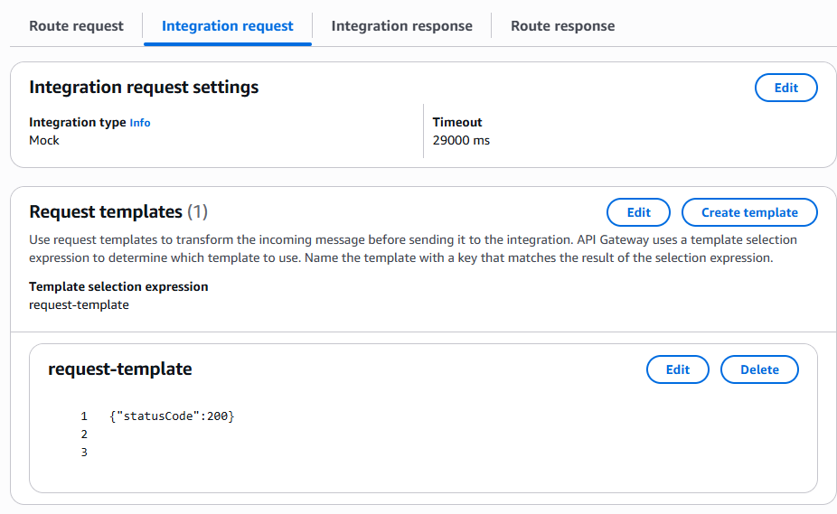
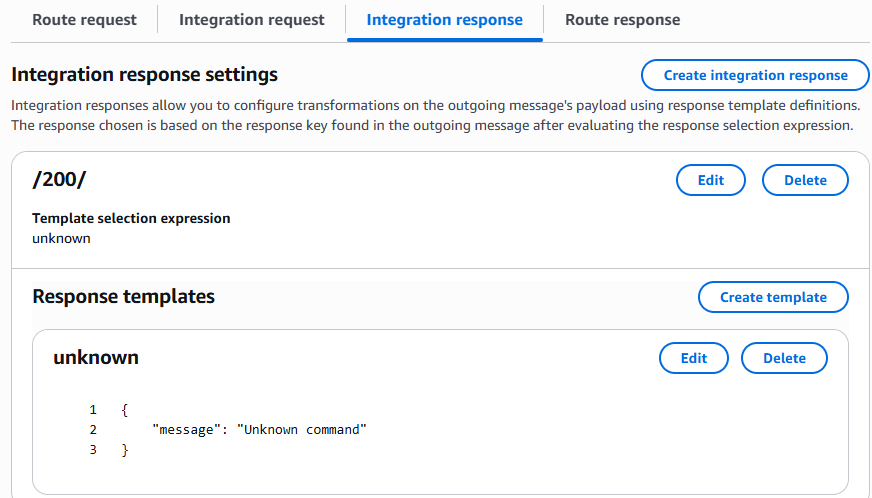

## Overview

A **WebSocket API** in API Gateway routes each client message to a backend integration using a **route key**. Three route keys are built in; you add custom keys (for example `message`, `subscribe`) for application actions.

| Route key | When it runs |
| --- | --- |
| `$connect` | During the WebSocket upgrade, before the connection is established |
| `$disconnect` | After the client disconnects |
| `$default` | When the incoming message does not match any other route key |
| Custom (e.g. `message`) | When the client sends a JSON body with `"action": "message"` (if route selection uses `request.body.action`) |

References:

- [WebSocket API routes](https://docs.aws.amazon.com/apigateway/latest/developerguide/apigateway-websocket-api-routes.html)
- [`$connect` and `$disconnect`](https://docs.aws.amazon.com/apigateway/latest/developerguide/apigateway-websocket-api-route-keys-connect-disconnect.html)
- [Integration requests](https://docs.aws.amazon.com/apigateway/latest/developerguide/apigateway-websocket-api-integration-requests.html)

---

## CLI inspection commands

Replace `API_ID`, `ROUTE_ID`, `INTEGRATION_ID`, and Region as needed.

```bash
# List routes
aws apigatewayv2 get-routes --api-id sjzk7q0onf --region us-east-1

# Check whether a route has a route response
aws apigatewayv2 get-route-responses --api-id sjzk7q0onf --route-id h6z3y2r --region us-east-1

# Inspect integration type and request templates
aws apigatewayv2 get-integration --api-id sjzk7q0onf --integration-id d4macp0 --region us-east-1
```

---

## What each route can read

| Route | `queryStringParameters` | Headers | `body` | `requestContext` |
| --- | --- | --- | --- | --- |
| `$connect` | Yes | Yes | No meaningful client message body (HTTP upgrade only) | Yes (`connectionId`, `routeKey`, etc.) |
| `$disconnect` | Limited | Limited | No | Yes (`disconnectStatusCode`, `disconnectReason`, …) |
| Custom routes | Yes | Yes | Yes | Yes |
| `$default` | Depends on integration | Depends on integration | Depends on integration | Yes |

On **`$connect`**, use query string parameters and headers for auth tokens (for example `?token=...`). The WebSocket handshake is an HTTP upgrade request, not an application message — do not expect a JSON body from the client at connect time.

On **custom route keys** (anything other than `$connect` / `$disconnect`), the Lambda event includes `body` and full `requestContext`.

---

## `$default` route with MOCK integration

Use MOCK when you want API Gateway to accept the connection or message without calling a backend service (for example a passthrough `$default` or a no-op `$connect`).

### Integration request

| Setting | Value |
| --- | --- |
| Integration type | `MOCK` |
| Request template | `{"statusCode": 200}` |

The request template **must** set `statusCode`. API Gateway uses it to select the matching integration response. Without a valid template/response pair, connections can fail with **500**.

Example request template (console often uses `application/json` as the template key):

```json
{"statusCode": 200}
```



### Integration response

| Setting | Value |
| --- | --- |
| Response key | `/200/` (matches `statusCode: 200` from the request template) |
| Template selection expression | Optional — only needed when you define response templates |



**Notes**

- Response key `/200/` corresponds to `statusCode` **200** in the integration request template.
- For `$connect`, the client does not receive a normal HTTP response body, but the integration response is still required for MOCK integrations — otherwise the handshake fails.
- To return errors from MOCK, add another request template value (for example `{"statusCode": 400}`) and a matching integration response key `/400/`.

Example CLI integration payload:

```json
{
  "PassthroughBehavior": "WHEN_NO_MATCH",
  "IntegrationType": "MOCK",
  "RequestTemplates": {
    "application/json": "{\"statusCode\":200}"
  }
}
```

---

## Lambda handler — custom `message` route

Example for a custom route that reads `queryStringParameters`, validates a token, and returns `connectionId` / `routeKey`.

Use on **`$connect`** for auth, or on a custom route if the client sends messages with a body.

```python
import json


def lambda_handler(event, context):
    print("FULL EVENT:")
    print(json.dumps(event))

    connection_id = event["requestContext"]["connectionId"]
    route_key = event["requestContext"]["routeKey"]

    qs = event.get("queryStringParameters") or {}
    print("QUERY STRING:", qs)
    token = qs.get("token")

    print("Connection ID:", connection_id)
    print("Route:", route_key)
    print("Token provided:", bool(token))

    if not token:
        return {
            "statusCode": 401,
            "body": json.dumps({"message": "Missing token"}),
        }

    # Validate token here
    # ...

    return {
        "statusCode": 200,
        "body": json.dumps({
            "connectionId": connection_id,
            "routeKey": route_key,
        }),
    }
```

**`$connect` behavior:** returning `statusCode` **401** (or **403**) from the `$connect` integration **rejects** the WebSocket connection. Returning **200** allows it.

**Custom routes:** parse `event["body"]` (JSON string) for application payloads. Use `@connections` API (`post_to_connection`) to send messages back to the client.

---

## Common issues

| Symptom | Likely cause |
| --- | --- |
| 500 on WebSocket connect with MOCK | Missing integration request template or integration response key `/200/` |
| Route not invoked | `routeSelectionExpression` does not match client message (check `action` field in body) |
| Token not found in Lambda | Token sent in connect URL query string — only available on `$connect`, not later messages unless client resends |
| Cannot message client | Missing `execute-api:ManageConnections` on the Lambda role for `post_to_connection` |

---

## Related notes

- [API Gateway with Cognito](/api-gateway-cognito/) — REST/HTTP auth patterns
- [Lambda Python runtime](/lambda-runtime-python/) — packaging and handler basics
