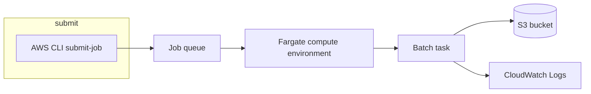

Quick path to run **AWS Batch** on **Fargate**: one container job that reads invoice JSON from S3 and writes a summary back. Same flow works for ETL, rendering, or any batch workload.

Current console, fair-share, and consumable resources: [AWS Batch in the current console](./aws-batch-console-guide.md).

## What you build



| Component | Purpose |
| --- | --- |
| Compute environment | Fargate capacity (subnets + security groups) |
| Job queue | Holds jobs until scheduler places them |
| Job definition | Image, CPU/memory, env, IAM roles, networking |
| Job | One run of the definition |

Reference code: [`dir/aws-batch/`](./dir/aws-batch/) (`job.py`, `Dockerfile`, [`job-definition.json`](./dir/aws-batch/job-definition.json), [`sample-input.json`](./dir/aws-batch/sample-input.json)).

## Prerequisites

- AWS CLI configured (`aws sts get-caller-identity`)
- Docker (to build the job image)
- A VPC with **at least one subnet** (two AZs recommended for production)
- First-time Batch in the account: AWS creates **`AWSServiceRoleForBatch`** when you use the console or `create-compute-environment`; if creation fails, see [service-linked roles](https://docs.aws.amazon.com/batch/latest/userguide/using-service-linked-roles.html)

Set shell variables used below:

```bash
export AWS_REGION=us-east-1
export AWS_ACCOUNT_ID=$(aws sts get-caller-identity --query Account --output text)
export PROJECT=batch-invoice-demo
```

## Example: invoice summarizer

The container ([`job.py`](./dir/aws-batch/job.py)) expects:

| Env var | Example |
| --- | --- |
| `INPUT_BUCKET` | `my-batch-demo-bucket` |
| `INPUT_KEY` | `input/invoices.json` |
| `OUTPUT_KEY` | `output/summary.json` |

Upload sample input:

```bash
aws s3 mb s3://my-batch-demo-bucket --region "$AWS_REGION"
aws s3 cp src/content/dir/aws-batch/sample-input.json \
  s3://my-batch-demo-bucket/input/invoices.json
```

## Step 1 - Security group

Fargate tasks get ENIs in your subnets. The group must allow **outbound** traffic your task needs.

**Tutorial / public subnet shortcut** (pull from ECR/Docker Hub over the internet):

| Direction | Rule |
| --- | --- |
| Outbound | All traffic → `0.0.0.0/0` (or tighten to HTTPS `443` only if you use VPC endpoints for ECR and logs) |
| Inbound | None required for this job (no listeners) |

```bash
export VPC_ID=$(aws ec2 describe-vpcs --filters Name=isDefault,Values=true \
  --query 'Vpcs[0].VpcId' --output text)

export BATCH_SG_ID=$(aws ec2 create-security-group \
  --group-name "${PROJECT}-sg" \
  --description "AWS Batch Fargate tasks" \
  --vpc-id "$VPC_ID" \
  --query GroupId --output text)

# Default SG often has no egress in some accounts; ensure outbound HTTPS at minimum.
aws ec2 authorize-security-group-egress \
  --group-id "$BATCH_SG_ID" \
  --protocol -1 \
  --cidr 0.0.0.0/0 2>/dev/null || true
```

Pick subnets in that VPC (use **public** subnets if you set `assignPublicIp: ENABLED`):

```bash
export SUBNET_IDS=$(aws ec2 describe-subnets \
  --filters "Name=vpc-id,Values=$VPC_ID" \
  --query 'Subnets[0:2].SubnetId' --output text | tr '\t' ',')
```

> **Production:** Prefer **private subnets**, `assignPublicIp: DISABLED`, NAT gateway or [VPC endpoints](https://docs.aws.amazon.com/AmazonECR/latest/userguide/vpc-endpoints.html) for ECR, S3, and CloudWatch Logs. Public IP on tasks is fine for learning only.

## Step 2 - IAM roles

### Execution role (required for Fargate)

Trust **ECS tasks**; attach **`AmazonECSTaskExecutionRolePolicy`** (image pull + `awslogs`).

```bash
cat > /tmp/batch-exec-trust.json <<'EOF'
{
  "Version": "2012-10-17",
  "Statement": [{
    "Effect": "Allow",
    "Principal": { "Service": "ecs-tasks.amazonaws.com" },
    "Action": "sts:AssumeRole"
  }]
}
EOF

aws iam create-role \
  --role-name BatchEcsTaskExecutionRole \
  --assume-role-policy-document file:///tmp/batch-exec-trust.json

aws iam attach-role-policy \
  --role-name BatchEcsTaskExecutionRole \
  --policy-arn arn:aws:iam::aws:policy/service-role/AmazonECSTaskExecutionRolePolicy
```

### Job role (task role - S3 access)

Trust **ECS tasks**; inline policy for the demo bucket only.

```bash
cat > /tmp/batch-job-trust.json <<'EOF'
{
  "Version": "2012-10-17",
  "Statement": [{
    "Effect": "Allow",
    "Principal": { "Service": "ecs-tasks.amazonaws.com" },
    "Action": "sts:AssumeRole"
  }]
}
EOF

aws iam create-role \
  --role-name BatchInvoiceJobRole \
  --assume-role-policy-document file:///tmp/batch-job-trust.json

cat > /tmp/batch-job-s3.json <<EOF
{
  "Version": "2012-10-17",
  "Statement": [{
    "Effect": "Allow",
    "Action": ["s3:GetObject", "s3:PutObject"],
    "Resource": "arn:aws:s3:::my-batch-demo-bucket/*"
  }]
}
EOF

aws iam put-role-policy \
  --role-name BatchInvoiceJobRole \
  --policy-name S3InvoiceAccess \
  --policy-document file:///tmp/batch-job-s3.json
```

Your user/role still needs Batch API permissions (e.g. `AWSBatchFullAccess` for the lab, or a tighter custom policy).

## Step 3 - Build image and push to ECR

```bash
export ECR_REPO=invoice-summarizer

aws ecr create-repository --repository-name "$ECR_REPO" --region "$AWS_REGION" 2>/dev/null || true

aws ecr get-login-password --region "$AWS_REGION" | \
  docker login --username AWS --password-stdin \
  "$AWS_ACCOUNT_ID.dkr.ecr.$AWS_REGION.amazonaws.com"

docker build -t "$ECR_REPO" src/content/dir/aws-batch
docker tag "$ECR_REPO:latest" \
  "$AWS_ACCOUNT_ID.dkr.ecr.$AWS_REGION.amazonaws.com/$ECR_REPO:latest"
docker push "$AWS_ACCOUNT_ID.dkr.ecr.$AWS_REGION.amazonaws.com/$ECR_REPO:latest"
```

## Step 4 - Compute environment

Managed Fargate environment (aligned with [AWS CLI tutorial](https://docs.aws.amazon.com/batch/latest/userguide/getting-started-with-fargate-using-the-aws-cli.html)):

1.  Go to **AWS Batch > Compute environments > Create**.
2.  Name: `${PROJECT}-fargate`.
3.  Provisioning model: **Fargate**.
4.  Network configuration: Select your VPC, the subnets you noted earlier, and the Security Group created in Step 1.
5.  Click **Create**. Wait for the status to turn **VALID**.

<details>
<summary>Create Compute Environment</summary>
```bash
aws batch create-compute-environment \
  --compute-environment-name "${PROJECT}-fargate" \
  --type MANAGED \
  --state ENABLED \
  --compute-resources "type=FARGATE,maxvCpus=4,subnets=${SUBNET_IDS},securityGroupIds=${BATCH_SG_ID}"

aws batch describe-compute-environments \
  --compute-environments "${PROJECT}-fargate" \
  --query 'computeEnvironments[0].status' \
  --output text
```
</details>

Wait until status is **`VALID`** (not `CREATING` or `INVALID`).

## Step 5 - Job queue

1.  Go to **AWS Batch > Job queues > Create**.
2.  Name: `${PROJECT}-queue`.
3.  Priority: `10`.
4.  Connected compute environments: Select the `${PROJECT}-fargate` environment created in Step 4.
5.  Click **Create**.

<details>
<summary>Create Job Queue</summary>

```bash
aws batch create-job-queue \
  --job-queue-name "${PROJECT}-queue" \
  --state ENABLED \
  --priority 10 \
  --compute-environment-order "order=1,computeEnvironment=${PROJECT}-fargate"
```
</details>

All compute environments on one queue must share the same provisioning model (do not mix Fargate and EC2 on the same queue).

## Step 6 - Job definition

Register from the template ([`job-definition.json`](./dir/aws-batch/job-definition.json)) after substituting account, region, and image:


1.  Go to **AWS Batch > Job definitions > Create**.
2.  Name: `invoice-summarizer`.
3.  Platform compatibility: **Fargate**.
4.  Container details:
    *   **Image:** Paste your ECR URI from Step 3.
    *   **Execution role:** Select `BatchEcsTaskExecutionRole`.
    *   **Job role:** Select `BatchInvoiceJobRole`.
    *   **Resource requirements:** vCPU `0.25`, Memory `512 MB`.
    *   **Environment variables:** Add `INPUT_BUCKET`, `INPUT_KEY`, and `OUTPUT_KEY` with their respective values.
    *   **Network configuration:** Check **Assign public IP**.
    *   **Log configuration:** Driver `awslogs`, Options: `awslogs-group: /aws/batch/job`, `awslogs-region: us-east-1`.
5.  Click **Create**.


<details>
<summary>Register Job Definition</summary>

```bash
export IMAGE="$AWS_ACCOUNT_ID.dkr.ecr.$AWS_REGION.amazonaws.com/$ECR_REPO:latest"

aws batch register-job-definition \
  --job-definition-name invoice-summarizer \
  --type container \
  --platform-capabilities FARGATE \
  --container-properties "{
    \"image\": \"$IMAGE\",
    \"resourceRequirements\": [
      {\"type\": \"VCPU\", \"value\": \"0.25\"},
      {\"type\": \"MEMORY\", \"value\": \"512\"}
    ],
    \"executionRoleArn\": \"arn:aws:iam::${AWS_ACCOUNT_ID}:role/BatchEcsTaskExecutionRole\",
    \"jobRoleArn\": \"arn:aws:iam::${AWS_ACCOUNT_ID}:role/BatchInvoiceJobRole\",
    \"environment\": [
      {\"name\": \"INPUT_BUCKET\", \"value\": \"my-batch-demo-bucket\"},
      {\"name\": \"INPUT_KEY\", \"value\": \"input/invoices.json\"},
      {\"name\": \"OUTPUT_KEY\", \"value\": \"output/summary.json\"}
    ],
    \"networkConfiguration\": {\"assignPublicIp\": \"ENABLED\"},
    \"logConfiguration\": {
      \"logDriver\": \"awslogs\",
      \"options\": {
        \"awslogs-group\": \"/aws/batch/job\",
        \"awslogs-region\": \"$AWS_REGION\",
        \"awslogs-stream-prefix\": \"invoice-summarizer\"
      }
    }
  }"
```
</details>

Fargate minimums: **0.25 vCPU** and **512 MiB** memory. Use valid [CPU/memory pairs](https://docs.aws.amazon.com/AmazonECS/latest/developerguide/task-cpu-memory-error.html).

## Step 7 - Submit and monitor

1.  Go to **AWS Batch > Jobs > Submit job**.
2.  Job name: `invoice-run-1`.
3.  Job queue: Select `${PROJECT}-queue`.
4.  Job definition: Select `invoice-summarizer`.
5.  Click **Submit**.
6.  Refresh the **Jobs** list to see the status change from `SUBMITTED` → `RUNNING` → `SUCCEEDED`.

<details>
<summary>Submit Job</summary>

```bash
export JOB_ID=$(aws batch submit-job \
  --job-name invoice-run-1 \
  --job-queue "${PROJECT}-queue" \
  --job-definition invoice-summarizer \
  --query jobId --output text)

echo "Job ID: $JOB_ID"

# Check status
aws batch describe-jobs --jobs "$JOB_ID" \
  --query 'jobs[0].status' --output text
```
</details>

Typical states: `SUBMITTED` → `PENDING` → `RUNNABLE` → `STARTING` → `RUNNING` → `SUCCEEDED` | `FAILED`.

On failure:

```bash
aws batch describe-jobs --jobs "$JOB_ID" \
  --query 'jobs[0].{status:status,reason:statusReason,container:container}'
```

## Step 8 - Verify output

1.  Go to **S3** and open `my-batch-demo-bucket/output/summary.json` to see the result.
2.  Go to **CloudWatch > Log groups > /aws/batch/job**. Click the latest stream to view stdout/stderr from your container.

<details>
<summary>Check Results</summary>

```bash
# Check S3 output
aws s3 cp s3://my-batch-demo-bucket/output/summary.json -

# Check Logs
LOG_STREAM=$(aws batch describe-jobs --jobs "$JOB_ID" \
  --query 'jobs[0].attempts[0].container.logStreamName' --output text)

aws logs get-log-events \
  --log-group-name /aws/batch/job \
  --log-stream-name "$LOG_STREAM"
```
</details>

Log group `/aws/batch/job` is created when the first job emits logs.

## Cleanup (order matters)

<details>
<summary>Delete Resources</summary>

```bash
# 1. Disable and Delete Queue
aws batch update-job-queue --job-queue "${PROJECT}-queue" --state DISABLED
aws batch delete-job-queue --job-queue "${PROJECT}-queue"

# 2. Disable and Delete Compute Environment
aws batch update-compute-environment --compute-environment "${PROJECT}-fargate" --state DISABLED
aws batch delete-compute-environment --compute-environment "${PROJECT}-fargate"

# 3. Delete IAM Roles
aws iam delete-role-policy --role-name BatchInvoiceJobRole --policy-name S3InvoiceAccess
aws iam delete-role --role-name BatchInvoiceJobRole
aws iam detach-role-policy --role-name BatchEcsTaskExecutionRole \
  --policy-arn arn:aws:iam::aws:policy/service-role/AmazonECSTaskExecutionRolePolicy
aws iam delete-role --role-name BatchEcsTaskExecutionRole

# 4. Delete S3 Bucket
aws s3 rb s3://my-batch-demo-bucket --force

# 5. Delete Security Group
aws ec2 delete-security-group --group-id "$BATCH_SG_ID"
```
</details>


Deregister job definitions separately if you want them gone (`aws batch deregister-job-definition`).

## Common pitfalls

| Symptom | Likely cause | Fix |
| --- | --- | --- |
| Job stuck **`RUNNABLE`** | Compute env not `VALID`, or no Fargate capacity / wrong subnets | `describe-compute-environments`; fix SG/subnets; check `maxvCpus` |
| **`CannotPullContainerError`** | No route to ECR (private subnet, no NAT/endpoints, public IP off) | NAT + endpoints, or public subnet + `assignPublicIp: ENABLED` |
| **`ResourceInitializationError`** (logs) | Missing or wrong **execution role** | `executionRoleArn` + `AmazonECSTaskExecutionRolePolicy` |
| S3 **AccessDenied** in task | Missing **job role** or wrong bucket ARN | `jobRoleArn` + least-privilege S3 policy |
| Compute env **`INVALID`** | Subnet not in VPC, bad SG, or missing Batch service-linked role | Fix networking; confirm `AWSServiceRoleForBatch` |
| Job **`FAILED`** immediately | Bad image URI, wrong platform | `platformCapabilities: FARGATE` must match Fargate CE |
| Queue blocked (Windows) | Windows job on Linux-only Fargate env | Match OS; Fargate Spot does not support Windows |
| Overrides ignored | vCPU/memory only in deprecated fields | Use `resourceRequirements` in definition and `containerOverrides.resourceRequirements` on submit |
| Long-running Fargate job killed | [14-day Fargate limit](https://docs.aws.amazon.com/batch/latest/userguide/job_retries.html) | Split work or use EC2 compute environment |

## EC2 vs Fargate (when to switch)

| | Fargate | EC2 compute environment |
| --- | --- | --- |
| Ops | No instances to manage | You manage AMI, scaling, ECS agent |
| Best for | Short jobs, quick start, variable sizes | GPU, very large memory, long runtimes, Spot fleets |
| Networking | Per-task ENI in your subnets | Instance ENI + host mode considerations |

Official walkthrough (busybox, no ECR): [Getting started with AWS Batch and Fargate using the AWS CLI](https://docs.aws.amazon.com/batch/latest/userguide/getting-started-with-fargate-using-the-aws-cli.html).
