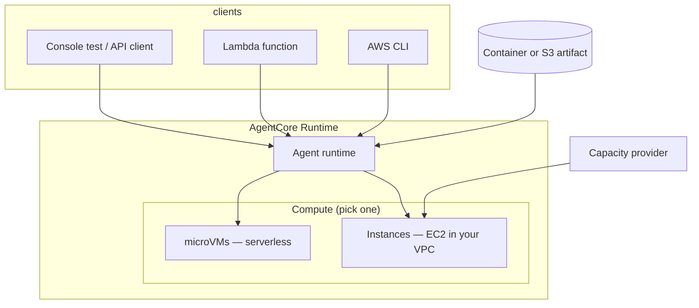

This walkthrough explains **Amazon Bedrock AgentCore Runtime** in plain terms: what you deploy, how **sessions** work, when to use **microVMs** versus **Instances (EC2 in your account)**, and how to **invoke** the same runtime from the **console**, **AWS CLI**, and **Lambda**.

The invoke API is the same for both compute types: `InvokeAgentRuntime` on the `bedrock-agentcore` data plane. EC2-backed runtimes add a **capacity provider** on the `bedrock-agentcore-control` control plane.

## What you are building



| Piece | Role |
| --- | --- |
| **Agent runtime** | Hosts your container or code artifact, protocol, auth, versions, and `DEFAULT` endpoint |
| **microVMs** (default) | Fully managed, fast cold start, sessions up to **8 hours**, one agent per session |
| **Instances** | EC2 managed in **your account** via a **capacity provider**; sessions up to **14 days**, GPUs, multi-agent on one instance |
| **`runtimeSessionId`** | You choose it (≥ **33 characters** for Instances); reuse it to hit the **same** session |
| **Lambda** | Calls `invoke_agent_runtime` with the runtime ARN and a stable or per-user session id |

## Prerequisites

- An AWS account with **Amazon Bedrock** model access enabled for the models your agent uses.
- **IAM** permissions to create runtimes and invoke them. For development, AWS documents attaching `BedrockAgentCoreFullAccess` to your user or role; for production, scope a custom policy (see [IAM permissions](https://docs.aws.amazon.com/bedrock-agentcore/latest/devguide/runtime-permissions.html)).
- **Region**: AgentCore is regional. Pick one region (for example `us-west-2`) and use it consistently in console, CLI, and Lambda environment variables.
- **AWS CLI v2** recent enough to include `bedrock-agentcore` and `bedrock-agentcore-control` commands (`aws bedrock-agentcore help`).

Set shell variables used in the CLI sections:

```bash
export AWS_REGION=us-west-2
export AWS_ACCOUNT_ID=$(aws sts get-caller-identity --query Account --output text)
```

---

## Part 1 — Fast path: microVM runtime with AgentCore CLI

Use this when you want a **serverless** agent without managing EC2. AWS recommends microVMs for lightweight, API-driven agents.

### Step 1: Install the CLI

Follow [Get started with the AgentCore CLI](https://docs.aws.amazon.com/bedrock-agentcore/latest/devguide/runtime-get-started-cli.html). In short:

```bash
pip install bedrock-agentcore-cli
agentcore --version
```

The CLI needs extra IAM permissions (CodeBuild, S3, ECR, IAM roles under `*BedrockAgentCore*`) documented in the permissions guide.

### Step 2: Scaffold and deploy

```bash
agentcore create my-agent --framework strands   # or langgraph, etc.
cd my-agent
agentcore dev          # local chat loop
agentcore deploy       # packages code, uses CDK, creates runtime + DEFAULT endpoint
```

First deploy may bootstrap CDK in the account; later deploys are faster.

### Step 3: Get the runtime ARN

After deploy, the CLI prints the runtime ARN, or list runtimes:

```bash
aws bedrock-agentcore-control list-agent-runtimes --region "$AWS_REGION"
```

### Step 4: Invoke (CLI)

Payload must be a **binary blob**. For JSON, use `fileb://` so the CLI does not try to base64-encode inline JSON incorrectly:

```bash
echo '{"prompt": "Summarize the benefits of AgentCore Runtime in three bullets."}' > payload.json

export RUNTIME_ARN="arn:aws:bedrock-agentcore:${AWS_REGION}:${AWS_ACCOUNT_ID}:runtime/my-agent-SUFFIX"
export SESSION_ID="$(uuidgen | tr -d '-')"   # reuse for conversation stickiness

aws bedrock-agentcore invoke-agent-runtime \
  --region "$AWS_REGION" \
  --agent-runtime-arn "$RUNTIME_ARN" \
  --runtime-session-id "$SESSION_ID" \
  --qualifier DEFAULT \
  --payload fileb://payload.json \
  response.json

cat response.json
```

The CLI writes the **agent body** to `response.json`; stdout shows metadata such as `contentType` and `statusCode`.

### Console (microVM)

1. Open the AWS Management Console → **Amazon Bedrock** → **AgentCore** (or **AgentCore Runtime**, depending on console labeling in your region).
2. Choose **Runtimes** → **Create runtime**.
3. Select compute type **microVMs** (default).
4. Provide the artifact (container URI in ECR or direct code deployment per wizard).
5. Assign or auto-create the **execution role** (trust `bedrock-agentcore.amazonaws.com`).
6. Create the runtime. AWS creates **version 1** and a **DEFAULT** endpoint automatically.
7. Use the runtime detail page **Test** tab (if available) or copy the **ARN** for CLI/Lambda invoke.

---

## Part 2 — EC2 Instances: capacity provider + runtime

Choose **Instances** when you need **long-lived sessions (up to 14 days)**, **GPU** instance types, **persistent EBS** scratch space, or **multiple agents** on one EC2 instance sharing a volume.

Important constraints from AWS docs:

- Do **not** set `networkConfiguration` on the runtime when using `capacityProviderConfiguration`; networking comes from the capacity provider VPC settings.
- Runtime `lifecycleConfiguration.maxLifetime` must be **≤** the capacity provider’s `ec2Configuration.lifecycleConfiguration.maxLifetime`.
- Capacity provider status must be **`READY`** before you attach it to a runtime (`GetCapacityProvider`).

### Step 1: IAM roles for Instances

Besides the **agent runtime execution role**, Instances use:

- **Capacity provider operator role** — AgentCore uses it to manage the provider.
- **Infrastructure role** — AgentCore assumes it to launch and manage EC2 in your account.

The console can create default roles when you create a capacity provider. For CLI, create roles first and pass ARNs in `permissionsConfiguration.capacityProviderOperatorRoleArn`.

### Step 2: Create a capacity provider (console)

1. **AgentCore** → **Capacity providers** → **Create capacity provider**.
2. Name the provider (for example `my_capacity_provider`).
3. **Compute**: Linux (`LINUX_X86_64` or `arm64`), allowed instance types (for example `m5.large`; for GPU use supported families: `g4dn`, `g5`, `g6`, `g6e`, `gr6`, `g6f`, `gr6f`, `g7e`, `inf2`).
4. **VPC**: subnets and security groups for agent egress (and any corporate network rules you need).
5. **Lifecycle**: `maxLifetime` for instances (example: 3600 seconds in AWS’s CLI tutorial).
6. **Volumes** (optional): EBS volume name, size, type (for example `scratch`, 50 GiB, `gp3`).
7. Create and wait until status is **READY**.

### Step 2 (alternate): Create a capacity provider (CLI)

Example aligned with [Get started with Instances using the AWS CLI](https://docs.aws.amazon.com/bedrock-agentcore/latest/devguide/runtime-instances-get-started-cli.html):

```bash
aws bedrock-agentcore-control create-capacity-provider \
  --region "$AWS_REGION" \
  --name "my_capacity_provider" \
  --permissions-configuration '{
    "capacityProviderOperatorRoleArn": "arn:aws:iam::'"$AWS_ACCOUNT_ID"':role/AgentCoreCapacityProviderOperatorRole"
  }' \
  --compute-configuration '{
    "ec2Configuration": {
      "launchTemplateSource": {
        "launchParameters": {
          "operatingSystem": "LINUX_X86_64",
          "instanceRequirements": {
            "allowedInstanceTypes": ["m5.large"]
          }
        }
      },
      "vpcConfiguration": {
        "subnets": ["subnet-0123456789abcdef0"],
        "securityGroups": ["sg-0123456789abcdef0"]
      },
      "lifecycleConfiguration": {
        "maxLifetime": 3600
      },
      "volumes": [
        { "ebsConfiguration": { "name": "scratch", "sizeGiB": 50, "volumeType": "gp3" } }
      ]
    }
  }'
```

Poll until ready:

```bash
aws bedrock-agentcore-control get-capacity-provider \
  --region "$AWS_REGION" \
  --capacity-provider-id "my_capacity_provider-XXXXXXXXXX" \
  --query 'status'
```

### Step 3: Create agent runtime on the capacity provider

**Console**

1. **Runtimes** → **Create runtime**.
2. Compute type: **Instances**.
3. Select your **capacity provider**.
4. Container image URI (ECR) or S3 artifact, plus **execution role**.
5. Optional: mount capacity provider volume at `/mnt/<name>` (path must be under `/mnt` with a single subdirectory, for example `/mnt/scratch`).
6. Set runtime lifecycle so `maxLifetime` does not exceed the provider’s limit (tutorial uses 1800 seconds when provider `maxLifetime` is 3600).

**CLI**

```bash
export CAPACITY_PROVIDER_ARN="arn:aws:bedrock-agentcore:${AWS_REGION}:${AWS_ACCOUNT_ID}:capacity-provider/my_capacity_provider-XXXXXXXXXX"

aws bedrock-agentcore-control create-agent-runtime \
  --region "$AWS_REGION" \
  --agent-runtime-name "my_instances_agent" \
  --role-arn "arn:aws:iam::${AWS_ACCOUNT_ID}:role/AgentRuntimeRole" \
  --agent-runtime-artifact '{
    "containerConfiguration": {
      "containerUri": "'"${AWS_ACCOUNT_ID}"'.dkr.ecr.'"${AWS_REGION}"'.amazonaws.com/my-agent:latest"
    }
  }' \
  --capacity-provider-configuration "{
    \"capacityProviderArn\": \"${CAPACITY_PROVIDER_ARN}\"
  }" \
  --lifecycle-configuration '{
    "idleRuntimeSessionTimeout": 300,
    "maxLifetime": 1800
  }' \
  --filesystem-configurations '[
    {
      "capacityProviderVolume": { "volumeName": "scratch", "mountPath": "/mnt/scratch" }
    }
  ]'
```

### Step 4: Invoke EC2-backed runtime (CLI)

First call for a **new** `runtimeSessionId` provisions EC2 in your account (higher latency). Reuse the same id for follow-up calls on the same instance.

```bash
export INSTANCES_RUNTIME_ARN="arn:aws:bedrock-agentcore:${AWS_REGION}:${AWS_ACCOUNT_ID}:runtime/my_instances_agent-suffix"
# Instances require runtimeSessionId length >= 33 characters
export SESSION_ID="project-xyz-0000000000000000000000000000"

echo '{"prompt": "List files under /mnt/scratch and explain what you see."}' > payload.json

aws bedrock-agentcore invoke-agent-runtime \
  --region "$AWS_REGION" \
  --agent-runtime-arn "$INSTANCES_RUNTIME_ARN" \
  --runtime-session-id "$SESSION_ID" \
  --qualifier DEFAULT \
  --payload fileb://payload.json \
  response.json
```

**See managed EC2 instances** (hidden from default `describe-instances`):

```bash
aws ec2 describe-instances --region "$AWS_REGION" --include-managed-resources \
  --filters "Name=tag-key,Values=bedrock-agentcore:capacity-provider-id" \
  --query 'Reservations[].Instances[].[InstanceId,State.Name,InstanceType]'
```

### Co-locate two agents on one instance

Invoke two **different** runtime ARNs that share the **same capacity provider** with the **same** `runtimeSessionId`. Both agents run on one EC2 instance and can share the mounted volume; each agent still uses its own runtime execution role credentials.

---

## Part 3 — Invoke from Lambda

Lambda is a common **front door**: API Gateway, EventBridge, or direct invoke → Lambda → AgentCore Runtime.

### IAM for the Lambda execution role

Minimum invoke permission on the runtime resource:

```json
{
  "Version": "2012-10-17",
  "Statement": [
    {
      "Effect": "Allow",
      "Action": "bedrock-agentcore:InvokeAgentRuntime",
      "Resource": "arn:aws:bedrock-agentcore:us-west-2:123456789012:runtime/*"
    }
  ]
}
```

If you pass `X-Amzn-Bedrock-AgentCore-Runtime-User-Id`, you also need `bedrock-agentcore:InvokeAgentRuntimeForUser`.

Tighten `Resource` to a single runtime ARN in production.

### Lambda function (Python 3.12)

```python
import json
import os
import uuid

import boto3

REGION = os.environ.get("AWS_REGION", "us-west-2")
RUNTIME_ARN = os.environ["AGENT_RUNTIME_ARN"]

client = boto3.client("bedrock-agentcore", region_name=REGION)


def lambda_handler(event, context):
    prompt = event.get("prompt") or event.get("body", "")
    if isinstance(prompt, dict):
        prompt = prompt.get("prompt", "")
    if not isinstance(prompt, str) or not prompt.strip():
        return {"statusCode": 400, "body": json.dumps({"error": "prompt must be a non-empty string"})}

    # Reuse session from client for stickiness, or start a new UUID per user/thread
    session_id = event.get("sessionId") or str(uuid.uuid4())

    payload = json.dumps({"prompt": prompt}).encode("utf-8")

    try:
        response = client.invoke_agent_runtime(
            agentRuntimeArn=RUNTIME_ARN,
            runtimeSessionId=session_id,
            payload=payload,
            qualifier=os.environ.get("AGENT_QUALIFIER", "DEFAULT"),
        )
    except client.exceptions.ThrottlingException:
        raise
    except Exception as exc:
        return {"statusCode": 502, "body": json.dumps({"error": str(exc)})}

    content_type = response.get("contentType", "")
    body_stream = response.get("response")

    if body_stream is None:
        return {"statusCode": 204, "body": "", "sessionId": session_id}

    if "text/event-stream" in content_type:
        lines = []
        for line in body_stream.iter_lines(chunk_size=1024):
            if not line:
                continue
            text = line.decode("utf-8")
            if text.startswith("data: "):
                text = text[6:]
            lines.append(text)
        agent_text = "\n".join(lines)
    elif content_type == "application/json":
        agent_text = json.loads(body_stream.read().decode("utf-8"))
    else:
        agent_text = body_stream.read().decode("utf-8")

    return {
        "statusCode": 200,
        "headers": {"Content-Type": "application/json"},
        "body": json.dumps({"sessionId": session_id, "response": agent_text}),
    }
```

Environment variables on the function:

| Variable | Example |
| --- | --- |
| `AGENT_RUNTIME_ARN` | `arn:aws:bedrock-agentcore:us-west-2:123456789012:runtime/my-agent-abc` |
| `AGENT_QUALIFIER` | `DEFAULT` |

For **Instances** runtimes, ensure `sessionId` from the client is at least **33 characters** (pad or use a prefixed UUID).

### Create the function (CLI)

```bash
zip function.zip lambda_function.py

aws lambda create-function \
  --region "$AWS_REGION" \
  --function-name agentcore-invoker \
  --runtime python3.12 \
  --role "arn:aws:iam::${AWS_ACCOUNT_ID}:role/agentcore-lambda-invoke-role" \
  --handler lambda_function.lambda_handler \
  --zip-file fileb://function.zip \
  --timeout 300 \
  --environment "Variables={AGENT_RUNTIME_ARN=${RUNTIME_ARN},AGENT_QUALIFIER=DEFAULT}"

aws lambda invoke \
  --region "$AWS_REGION" \
  --function-name agentcore-invoker \
  --payload '{"prompt":"Hello from Lambda","sessionId":"user-42-000000000000000000000000000"}' \
  out.json

cat out.json
```

### Console (Lambda)

1. **Lambda** → **Create function** → Author from scratch, Python 3.12.
2. Paste the handler code (or upload a `.zip`).
3. **Configuration** → **Environment variables**: set `AGENT_RUNTIME_ARN`.
4. **Configuration** → **Permissions**: attach an inline policy with `bedrock-agentcore:InvokeAgentRuntime` on your runtime ARN.
5. **Test** with event JSON `{"prompt": "Hi"}`.
6. Optional: add **API Gateway** HTTP API as trigger for external clients.

AWS also publishes a workshop sample with observability: [Lambda AgentCore invocation](https://github.com/awslabs/agentcore-samples/tree/main/06-workshops/06-AgentCore-observability/05-Lambda-AgentCore-invocation).

---

## Sessions, errors, and cleanup

### Session rules (both compute types)

- Call **`InvokeAgentRuntime`** with the same `runtimeSessionId` to continue a conversation in one isolated environment.
- microVM: dedicated microVM per session, max **8 hours** total runtime per session lifecycle.
- Instances: EC2 session up to **14 days**; stopped sessions can resume with the same id and reattached EBS data.
- Handle **`RetryableConflictException` (409)** with short backoff while a session is provisioning or tearing down.

Validate that `prompt` is a **string** in your agent entrypoint; non-string JSON can have security implications (see invoke guide best practices).

### Stop one agent vs delete whole session (Instances)

```bash
# Stop a single runtime in a session (other agents on same instance keep running)
aws bedrock-agentcore stop-runtime-session \
  --region "$AWS_REGION" \
  --agent-runtime-arn "$INSTANCES_RUNTIME_ARN" \
  --runtime-session-id "$SESSION_ID"

# Delete session and deprovision EC2 + EBS for that session id
aws bedrock-agentcore delete-capacity-provider-session \
  --region "$AWS_REGION" \
  --capacity-provider-id "my_capacity_provider-XXXXXXXXXX" \
  --session-id "$SESSION_ID"
```

Deleting the **capacity provider** stops all its sessions and storage; remove dependent runtimes first.

```bash
aws bedrock-agentcore-control delete-capacity-provider \
  --region "$AWS_REGION" \
  --capacity-provider-id "my_capacity_provider-XXXXXXXXXX"
```

---

## Choose microVM vs Instances

| Need | Prefer |
| --- | --- |
| Quick API agent, minimal ops | **microVMs** + AgentCore CLI |
| 14-day sessions, GPU, shared disk between agents | **Instances** + capacity provider |
| Invoke from app or Lambda | **`InvokeAgentRuntime`** (same API) |
| Shell/git in session | **`InvokeAgentRuntimeCommand`** (same session as agent) |

---

## Verify against current documentation

This post was written against the Amazon Bedrock AgentCore Developer Guide sections linked in **Resources** above, including:

- Capacity provider status **`READY`** before runtime association
- **`fileb://`** for CLI payloads
- **`runtimeSessionId`** minimum length for Instances
- Lambda permission **`bedrock-agentcore:InvokeAgentRuntime`**

When AWS updates console labels or API field names, treat the [AgentCore Control API Reference](https://docs.aws.amazon.com/bedrock-agentcore-control/latest/APIReference/Welcome.html) and [AgentCore API Reference](https://docs.aws.amazon.com/bedrock-agentcore/latest/APIReference/Welcome.html) as authoritative.
