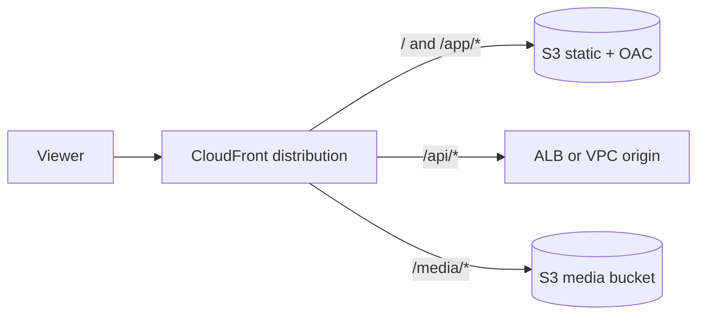

One hostname (`www.example.com`) can serve a static site, an API, and media from **different backends**. CloudFront does that with **multiple origins** on a single distribution. A **cache behavior** maps a URL path to one origin (or an origin group). When the path is not enough, a **CloudFront Function** can pick the origin per request.



## How the pieces fit

| Piece | What it does |
| --- | --- |
| **Origin** | Where CloudFront fetches content: S3 REST endpoint, ALB, API Gateway, Lambda function URL, MediaPackage, EC2, or a VPC origin |
| **Origin ID** | Name you choose. Behaviors and functions refer to this ID |
| **Origin path** | Prefix CloudFront adds in front of the viewer URI when it calls that origin |
| **Cache behavior** | Path pattern, cache policy, origin request policy, and the target origin or origin group |
| **Default behavior** | Path pattern `*`. CloudFront uses it when no earlier behavior matches |
| **Origin group** | Primary plus secondary origin. Failover on selected HTTP status codes |
| **OAC** | Signs requests to a private S3 bucket (or a Lambda function URL with IAM auth) |
| **VPC origin** | Private ALB, NLB, or EC2 in your VPC, reachable only from CloudFront |

CloudFront evaluates cache behaviors **in list order**. The **first matching path pattern wins**. Put specific paths (`/api/*`, `/media/*`) above the default `*`.

The viewer URI is what the browser requested. The **origin path** is extra. If the origin path is `/releases/v2` and the viewer asks for `/index.html`, the origin sees `/releases/v2/index.html`.

## A practical layout

| Viewer path | Origin | Cache | Why |
| --- | --- | --- | --- |
| `/media/*` | S3 media bucket, OAC | CachingOptimized | Large, versioned objects |
| `/api/*` | ALB (or API Gateway) | CachingDisabled | Dynamic, authenticated |
| Default `*` | S3 website assets, OAC | CachingOptimized | HTML, JS, CSS |

Use the **S3 REST** domain (`bucket.s3.region.amazonaws.com`), not the S3 website endpoint, when you use OAC. The website endpoint is a custom origin and does not take OAC.

For the ALB behavior, use the managed origin request policy **AllViewerExceptHostHeader**. That forwards viewer headers, cookies, and query strings, and lets CloudFront set `Host` to the origin domain. Forwarding the viewer `Host` (`www.example.com`) to an ALB that only has a target-group rule for its own DNS name returns 403 or a default action you did not expect.

Managed policy IDs (stable):

| Policy | ID |
| --- | --- |
| CachingOptimized | `658327ea-f89d-4fab-a63d-7e88639e58f6` |
| CachingDisabled | `4135ea2d-6df8-44a3-9df3-4b5a84be39ad` |
| AllViewerExceptHostHeader (origin request) | `b689b0a8-53d0-40ab-baf2-68738e2966ac` |

## Console

1. **CloudFront** → **Distributions** → **Create distribution**.
2. **Origin 1:** S3 bucket. Origin access: **Origin access control settings (recommended)**. Create a new OAC. Copy the bucket policy CloudFront shows and attach it to the bucket (it allows `cloudfront.amazonaws.com` with a condition on this distribution ARN).
3. **Add origin** for the media bucket the same way (its own OAC or the same OAC; the bucket policy must allow this distribution).
4. **Add origin** for the ALB: origin type custom, HTTPS only, origin domain the ALB DNS name.
5. **Behaviors:** create `/media/*` → media origin, `/api/*` → ALB origin, then leave **Default (*)** on the static bucket. Drag behaviors so the specific patterns sit **above** Default.
6. Viewer protocol policy: **Redirect HTTP to HTTPS**. Attach an **ACM certificate in us-east-1** if you use a custom domain, and add the alternate domain name (CNAME).
7. Optional: **AWS WAF** web ACL on the distribution, and standard or real-time access logs.
8. Create the distribution. Point Route 53 (alias) at the distribution domain name.

After a static deploy, invalidate what changed:

```bash
aws cloudfront create-invalidation \
  --distribution-id E1234567890ABC \
  --paths "/index.html" "/app/*"
```

## CLI: OAC, then inspect the distribution

Create an OAC (SigV4, always sign, S3):

```bash
aws cloudfront create-origin-access-control \
  --origin-access-control-config '{
    "Name": "static-site-oac",
    "Description": "OAC for the static site bucket",
    "SigningProtocol": "sigv4",
    "SigningBehavior": "always",
    "OriginAccessControlOriginType": "s3"
  }'
```

A full `create-distribution` document is long because every behavior needs cache and origin-request policy IDs. The reliable edit path is: create in the console (or IaC), then change with the API using the **ETag**:

```bash
aws cloudfront get-distribution-config --id E1234567890ABC > dist.json
# ETag is in the response. Edit Origins and CacheBehaviors in the JSON.
# Pass --if-match with that ETag on update-distribution.
aws cloudfront update-distribution \
  --id E1234567890ABC \
  --if-match ETAG_FROM_GET \
  --distribution-config file://distribution-config.json
```

Confirm which origin a path uses:

```bash
aws cloudfront get-distribution-config --id E1234567890ABC \
  --query 'DistributionConfig.CacheBehaviors.Items[].{Path:PathPattern,Origin:TargetOriginId}'
```

Bucket policy sketch for OAC (replace account, bucket, and distribution):

```json
{
  "Version": "2012-10-17",
  "Statement": [
    {
      "Sid": "AllowCloudFrontRead",
      "Effect": "Allow",
      "Principal": { "Service": "cloudfront.amazonaws.com" },
      "Action": "s3:GetObject",
      "Resource": "arn:aws:s3:::my-static-bucket/*",
      "Condition": {
        "StringEquals": {
          "AWS:SourceArn": "arn:aws:cloudfront::111122223333:distribution/E1234567890ABC"
        }
      }
    }
  ]
}
```

Block public access on the bucket. OAC does not need a public object ACL.

## Origin groups (failover)

An origin group has **two** origins: primary and secondary. On a cache miss, CloudFront calls the primary. If the primary returns a status code you listed, or the connection fails when you included that case, CloudFront sends the **same** request to the secondary.

Failover status codes you can select: **400, 403, 404, 416, 429, 500, 502, 503, 504**. Connection failures use **503**. Origin timeouts use **504**.

CloudFront fails over only for viewer methods **GET, HEAD, and OPTIONS**. **POST, PUT, PATCH, and DELETE** stay on the primary and return that origin’s error.

Failover is **per request**, not a global flip. One 200 and one 502 in the same second go to different origins.

Console: **Origins** → **Create origin group** → pick primary and secondary → choose status codes → point a cache behavior at the **group ID** instead of a single origin.

Use failover when both origins serve the **same paths and the same bytes** (S3 cross-region replication, or two ALBs with the same app). Do not list **404** as a failover code for a normal static site: a missing file would be fetched again from the second bucket and can be cached as a success from the wrong place. Keep 404 as a failover code for active-active content stores where “not found” means the primary replica is wrong or empty.

Default connection behavior is about **30 seconds** (three attempts of 10 seconds) before failover when 503/504 are in the list. For video or health-checked origins, lower **connection attempts** and **connection timeout** on the primary origin so failover happens sooner. Those same settings on a secondary origin control how fast CloudFront returns **504** to the viewer.

## Private app origins

**Custom header shared secret.** Add an origin custom header such as `X-Origin-Verify: <long random value>`. On the ALB, a listener rule or WAF allows only that header. Viewers cannot see origin custom headers in the response. Rotate the value by updating the origin and the ALB together.

**VPC origins.** CloudFront connects privately to an ALB, NLB, or EC2 instance in a subnet you choose. CloudFront creates a managed security group named like `CloudFront-VPCOrigins-Service-SG`. Allow that group on the origin’s security group. Inbound NACLs are not applied to this path; **outbound** NACL rules still must allow ephemeral ports (1024–65535) back toward CloudFront.

VPC origins do not support **gRPC** or **Lambda@Edge origin-request / origin-response** triggers. Use a CloudFront Function (below) when you need to change a VPC origin per request.

## Choose the origin in a function

Path behaviors are the right tool when the URL prefix is stable. When the choice depends on country, a header, or a percentage rollout, use a **CloudFront Function, JavaScript runtime 2.0**, on **viewer request**:

```javascript
import cf from 'cloudfront';

function handler(event) {
  const request = event.request;
  const country = request.headers['cloudfront-viewer-country']
    && request.headers['cloudfront-viewer-country'].value;

  // Origin IDs must already exist on the distribution.
  if (country === 'DE' || country === 'FR') {
    cf.selectRequestOriginById('s3-eu-media');
  }
  return request;
}
```

`selectRequestOriginById` only selects an origin **already defined** on the distribution, including a VPC origin or an origin that belongs to a group. `updateRequestOrigin` can point at a new domain name and can attach OAC settings, but it **cannot** retarget a VPC origin.

CloudFront Functions on viewer request run on **every** request, including cache hits (the function can still change what happens before the cache key is used). Lambda@Edge **origin request** runs on **cache misses** and can read DynamoDB or S3, which costs less on highly cacheable sites and more on fully dynamic ones. Lambda@Edge origin triggers and VPC origins cannot be combined.

The function test console checks that the code runs. It does not prove the origin switch happened. Verify with access logs (`x-edge-detailed-result-type`, origin domain) or a distinct response header from each origin.

## Checks that save a rollout

| Symptom | What to fix |
| --- | --- |
| `/api` returns the static site | Behavior order: `/api/*` is below `*`, or the pattern does not match (`/api*` vs `/api/*`) |
| ALB 403, S3 fine | Origin request policy forwarded the viewer `Host` header |
| S3 403 from CloudFront | Bucket policy source ARN, wrong OAC, or SSE-KMS key policy missing `cloudfront.amazonaws.com` |
| SPA routes 404 at the edge | Default root object only covers `/`. For client-side routes, rewrite to `/index.html` in a viewer-request function, or use a custom error response |
| POST never hits the standby region | Expected: origin groups do not fail over POST |
| Stale JS after deploy | Invalidate the changed paths, or version the filenames |
| Second region never used | Failover codes omit 502/503/504, or the object was already cached from the primary |

## What to turn on for production

- **HTTPS only** to viewers and to custom origins. Minimum TLS 1.2.
- **OAC** on every S3 origin. Leave the bucket private.
- **WAF** on the distribution if browsers hit it.
- **Access logs** (standard to S3, or real-time to Kinesis) so you can see which origin served a URL.
- Separate **cache policies**: long TTL for hashed assets, disabled cache for `/api/*`.
- **Response headers policy** for security headers (HSTS, `X-Content-Type-Options`) on the static behaviors.
- Price class and geographic restrictions only when you mean to drop regions.

## Short map

| Goal | Use |
| --- | --- |
| `/media` from S3, `/api` from ALB, everything else from the site bucket | Multiple origins + ordered cache behaviors |
| Same URL, second region when the first errors | Origin group, and do not fail over POST |
| Private ALB with no public listener | VPC origin, or a custom header plus a public ALB locked to CloudFront |
| Country or header picks the bucket | CloudFront Function `selectRequestOriginById` on viewer request |
| Lookup in DynamoDB before choosing an origin | Lambda@Edge origin request, on origins that are not VPC origins |
