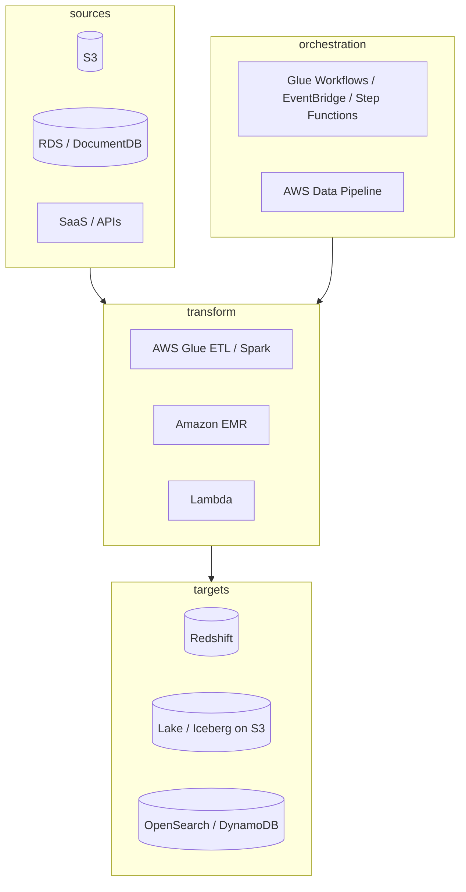

**ETL** (extract, transform, load) on AWS is usually split into: **where data lives**, **how you transform it**, and **what orchestrates** the steps.

## Pick a tool (quick guide)

| Service | Best for | You manage |
| --- | --- | --- |
| **AWS Glue** | Serverless Spark/Python ETL, crawlers, **Data Catalog**, scheduled jobs | Job scripts, IAM, connections |
| **Amazon EMR** | Large or long-running Spark/Hive clusters, fine-grained tuning | Clusters, patching, capacity |
| **AWS DMS** | **CDC** and homogeneous/heterogeneous **database replication** (e.g. DocumentDB → S3, RDS → Aurora) | Replication instances, task mapping |
| **Lambda + S3** | Small files, event-driven transforms (CSV → Parquet) | Code limits, concurrency |
| **Athena + CTAS** | SQL transforms directly on S3 data | Table DDL, partition strategy |
| **Redshift `COPY` / Spectrum** | Warehouse load and query over the lake | WLM, sort keys, grants |
| **AWS Data Pipeline** | Legacy **schedule + dependency** orchestration across EMR, RDS, S3 | Pipeline definitions (many teams prefer Glue Workflows or Step Functions for new work) |
| **Amazon AppFlow** | SaaS → S3/Salesforce-style **managed** ingestion | Flow configuration |

## DocumentDB → analytics

Common patterns when the operational store is DocumentDB:

1. **DMS** (ongoing CDC or full load) to **S3** (Parquet/JSON) → **Glue** catalog → **Athena** or **Redshift Spectrum**.
2. **Glue ETL job** reading from a JDBC DocumentDB connection (with TLS connection properties and the RDS CA bundle) → curated zone on S3.
3. **Application-level export** (batch job on ECS/EKS) when you need custom aggregation before landing in the lake.

For TLS to DocumentDB from Glue or custom jobs, use SSL in the connection and trust `global-bundle.pem`—see the dedicated DocumentDB TLS post on this site.

## Minimal Glue mental model

1. **Crawler** (or manual table) → **Glue Data Catalog** metadata.
2. **ETL job** (Spark or Python shell) reads source, transforms, writes target.
3. **Trigger** (schedule or event) starts the job; **Workflow** chains crawlers + jobs.
4. Pay for **DPUs** (or Ray workers) while the job runs—no cluster to provision in the serverless model.

Example: nightly job lands denormalized collections from S3 raw prefix to `s3://data-lake/curated/docdb/orders/` partitioned by `dt=YYYY-MM-DD`, then Athena or Redshift loads from there.

## Design habits that age well

- **Land raw** in S3 (immutable), **curate** in a second stage—replay transforms without re-hitting the source database.
- Use **IAM roles**, not access keys, for Glue, DMS, and Lambda.
- Align **encryption**: TLS to databases; **SSE-KMS** on S3; enforce TLS on Redshift and Glue connections.
- Monitor with **CloudWatch** job metrics, **DMS task** latency, and alarms on failed pipeline runs.

## When “ETL” is really “ELT”

Many teams **extract/load** raw data first (DMS, AppFlow, Firehose), then **transform in the warehouse or with Athena SQL** (ELT). Glue fits both models; choose based on whether Spark complexity is worth it versus SQL-only transforms.

## Summary

| Need | Start here |
| --- | --- |
| Serverless Spark + catalog | **AWS Glue** |
| Database replication / CDC | **AWS DMS** |
| Heavy or custom Spark clusters | **Amazon EMR** |
| Orchestration | **Glue Workflows**, **EventBridge**, or **Step Functions** |

Official references are linked in **Resources** at the top of this page.
