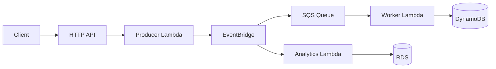

> Build and operate an event-driven serverless order pipeline with AWS SAM - Lambda, HTTP API, EventBridge, SQS, DynamoDB, and safe deployments.


## What you build

A minimal **order events** system:

1. **Producer API** accepts orders and publishes `OrderCreated` to EventBridge
2. **SQS + worker Lambda** processes messages and writes to DynamoDB
3. **Analytics Lambda** (optional) persists events to RDS for reporting
4. **SAM** packages and deploys everything; **CodeDeploy** canaries production releases

## Architecture



## Phase 01: 01-sam-project-setup

## Objective

Initialize an AWS SAM application for the order-events pipeline with a clear directory layout and shared `Globals` for Lambda runtime settings.

## Architecture

```
order-serverless/
├── template.yaml          # SAM/CloudFormation
├── samconfig.toml         # deploy defaults (optional, gitignored if sensitive)
├── src/
│   ├── producer/
│   ├── worker/
│   └── analytics/
├── events/                # sample payloads for local invoke
└── tests/
```

## Commands

```bash
sam init
## Runtime: python3.12
## Template: Hello World with API Gateway
## Name: order-serverless

cd order-serverless
sam validate
```

## Manifests

### Minimal `template.yaml` skeleton

```yaml
AWSTemplateFormatVersion: "2010-09-09"
Transform: AWS::Serverless-2016-10-31
Description: Order events - SAM walkthrough

Globals:
  Function:
    Runtime: python3.12
    Timeout: 30
    MemorySize: 256
    Architectures: [x86_64]
    Tracing: Active
    Environment:
      Variables:
        LOG_LEVEL: INFO

Resources:
  # Functions and event sources added in later phases
```

### `samconfig.toml` (after first guided deploy)

```toml
version = 0.1
[default.deploy.parameters]
stack_name = "order-serverless"
resolve_s3 = true
capabilities = "CAPABILITY_IAM"
confirm_changeset = true
```

## Verification

```bash
sam validate --lint
## Expected: template is valid
```

## Troubleshooting

### `Transform AWS::Serverless-2016-10-31` not found

Install/update [AWS SAM CLI](https://docs.aws.amazon.com/serverless-application-model/latest/developerguide/install-sam-cli.html) and ensure AWS credentials target the intended account/Region.

---

## Phase 02: 02-lambda-functions

## Objective

Define the **producer Lambda** that accepts order payloads and publishes to EventBridge, with an execution role scoped to `events:PutEvents` only.

## Architecture

```
API Gateway event
  → ProducerFunction (Python 3.12)
  → events:PutEvents (default bus)
  → returns 200 + order JSON
```

## Commands

```bash
sam build
sam local invoke ProducerFunction --event events/create-order.json
```

### Sample event (`events/create-order.json`)

```json
{
  "body": "{\"userId\":\"user-101\",\"amount\":250}",
  "requestContext": { "http": { "method": "POST" } }
}
```

## Manifests

### SAM function resource

```yaml
ProducerFunction:
  Type: AWS::Serverless::Function
  Properties:
    Handler: app.lambda_handler
    CodeUri: src/producer/
    Description: Publishes OrderCreated events
    Policies:
      - EventBridgePutEventsPolicy:
          EventBusName: default
```

### Handler (from [Lambda event pipeline](/blog/examples/lambda-event-pipeline))

```python
import json
import boto3
import uuid

eventbridge = boto3.client("events")

def lambda_handler(event, context):
    body = json.loads(event.get("body") or "{}")
    order = {
        "orderId": str(uuid.uuid4()),
        "userId": body.get("userId", "unknown"),
        "amount": body.get("amount", 0),
        "status": "CREATED",
    }
    eventbridge.put_events(
        Entries=[{
            "Source": "app.orders",
            "DetailType": "OrderCreated",
            "Detail": json.dumps(order),
            "EventBusName": "default",
        }]
    )
    return {"statusCode": 200, "body": json.dumps(order)}
```

## Verification

```bash
sam local invoke ProducerFunction --event events/create-order.json
## Expected: statusCode 200, body contains orderId

## After deploy (Phase 07):
aws logs tail /aws/lambda/order-serverless-ProducerFunction --since 5m
```

## Troubleshooting

### `AccessDeniedException` on PutEvents

SAM policy missing or wrong `EventBusName`. For custom buses, scope the policy to that bus ARN.

### Handler import errors locally

Run `sam build` before `sam local invoke` so dependencies are copied into `.aws-sam/build`.

## Phase 03: 03-http-api-gateway

## Objective

Expose the producer Lambda through an **HTTP API** (API Gateway v2) with `POST /orders`, explicit CORS, and automatic Lambda proxy integration via SAM events.

## Architecture

```
Client POST /orders
  → HTTP API (v2)
  → Lambda proxy integration
  → ProducerFunction
```

## Commands

```bash
sam local start-api
curl -s -X POST http://127.0.0.1:3000/orders \
  -H "Content-Type: application/json" \
  -d '{"userId":"user-101","amount":250}'
```

## Manifests

```yaml
ProducerFunction:
  Type: AWS::Serverless::Function
  Properties:
    Handler: app.lambda_handler
    CodeUri: src/producer/
    Events:
      CreateOrder:
        Type: HttpApi
        Properties:
          ApiId: !Ref OrderHttpApi
          Path: /orders
          Method: POST

OrderHttpApi:
  Type: AWS::Serverless::HttpApi
  Properties:
    StageName: $default
    CorsConfiguration:
      AllowOrigins: ["https://app.example.com"]
      AllowMethods: [GET, POST, OPTIONS]
      AllowHeaders: [Content-Type, Authorization]
      MaxAge: 300

Outputs:
  ApiEndpoint:
    Value: !Sub "https://${OrderHttpApi}.execute-api.${AWS::Region}.amazonaws.com"
```

## Verification

```bash
## Local
sam local start-api
curl -i -X POST http://127.0.0.1:3000/orders -d '{"userId":"u1","amount":99}'

## Deployed
curl -i -X POST "$API_ENDPOINT/orders" -H "Content-Type: application/json" \
  -d '{"userId":"u1","amount":99}'
```

## Troubleshooting

### CORS preflight fails

Ensure `OPTIONS` is in `AllowMethods` and the stage CORS config matches the browser origin exactly (no trailing slash mismatch).

### 403 from API Gateway

Check Lambda resource policy created by SAM and that the route `Method`/`Path` match the client request.

## Phase 04: 04-eventbridge

## Objective

Route `OrderCreated` events from the default bus to an **SQS queue** (and optionally an analytics Lambda) using EventBridge rules with explicit `eventPattern` filters.

## Architecture

```
Producer PutEvents
  → default event bus
  → Rule: OrderCreatedRule
      ├── Target: OrderQueue (SQS)
      └── Target: AnalyticsFunction (optional)
```

## Commands

```bash
## After deploy - put a test event
aws events put-events --entries '[
  {
    "Source": "app.orders",
    "DetailType": "OrderCreated",
    "Detail": "{\"orderId\":\"test-1\",\"userId\":\"u1\",\"amount\":10,\"status\":\"CREATED\"}"
  }
]'

aws sqs get-queue-attributes --queue-url $QUEUE_URL \
  --attribute-names ApproximateNumberOfMessages
```

## Manifests

```yaml
OrderQueue:
  Type: AWS::SQS::Queue
  Properties:
    QueueName: order-events
    VisibilityTimeout: 60
    RedrivePolicy:
      deadLetterTargetArn: !GetAtt OrderDLQ.Arn
      maxReceiveCount: 3

OrderDLQ:
  Type: AWS::SQS::Queue
  Properties:
    QueueName: order-events-dlq

OrderCreatedRule:
  Type: AWS::Events::Rule
  Properties:
    EventBusName: default
    EventPattern:
      source: [app.orders]
      detail-type: [OrderCreated]
    Targets:
      - Id: OrderQueueTarget
        Arn: !GetAtt OrderQueue.Arn

OrderQueuePolicy:
  Type: AWS::SQS::QueuePolicy
  Properties:
    Queues: [!Ref OrderQueue]
    PolicyDocument:
      Statement:
        - Effect: Allow
          Principal: { Service: events.amazonaws.com }
          Action: sqs:SendMessage
          Resource: !GetAtt OrderQueue.Arn
          Condition:
            ArnEquals:
              aws:SourceArn: !GetAtt OrderCreatedRule.Arn
```

### Event schema

| Field | Type | Example |
|-------|------|---------|
| `source` | string | `app.orders` |
| `detail-type` | string | `OrderCreated` |
| `detail.orderId` | string | UUID |
| `detail.userId` | string | `user-101` |
| `detail.amount` | number | `250` |
| `detail.status` | string | `CREATED` |

## Verification

```bash
aws events list-rules --event-bus-name default --name-prefix Order
aws sqs receive-message --queue-url $QUEUE_URL --max-number-of-messages 1
```

## Troubleshooting

### Rule matches but queue empty

Missing or incorrect **SQS queue policy** allowing `events.amazonaws.com`. The `aws:SourceArn` condition must match the rule ARN.

### Events on bus but rule not triggered

`eventPattern` is case-sensitive - `detail-type` must match `DetailType` from `put_events` exactly.

## Phase 05: 05-sqs-lambda-triggers

## Objective

Connect **OrderQueue** to a **worker Lambda** via an event source mapping with tuned batch size, visibility timeout, and DLQ handling.

## Architecture

```
SQS OrderQueue
  → event source mapping (batch up to 10)
  → WorkerFunction
  → DynamoDB PutItem (Phase 06)
  → DeleteMessage on success
```

## Commands

```bash
sam build
sam local invoke WorkerFunction --event events/sqs-order.json
```

### Sample SQS event (`events/sqs-order.json`)

```json
{
  "Records": [{
    "body": "{\"Message\":\"{\\\"orderId\\\":\\\"ord-1\\\",\\\"userId\\\":\\\"u1\\\",\\\"amount\\\":99,\\\"status\\\":\\\"CREATED\\\"}\"}"
  }]
}
```

## Manifests

```yaml
WorkerFunction:
  Type: AWS::Serverless::Function
  Properties:
    Handler: app.lambda_handler
    CodeUri: src/worker/
    Policies:
      - SQSPollerPolicy:
          QueueName: !GetAtt OrderQueue.QueueName
      - DynamoDBCrudPolicy:
          TableName: !Ref OrdersTable
    Events:
      OrderQueueEvent:
        Type: SQS
        Properties:
          Queue: !GetAtt OrderQueue.Arn
          BatchSize: 10
          MaximumBatchingWindowInSeconds: 5
          FunctionResponseTypes:
            - ReportBatchItemFailures
```

### Worker handler pattern

```python
import json
import boto3

dynamodb = boto3.resource("dynamodb")
table = dynamodb.Table("OrdersTable")

def lambda_handler(event, context):
    failures = []
    for record in event["Records"]:
        try:
            body = json.loads(record["body"])
            # EventBridge → SQS wraps in SNS-style Message when using rule target
            detail = json.loads(body.get("Message", body))
            table.put_item(Item={
                "orderId": detail["orderId"],
                "userId": detail["userId"],
                "amount": detail["amount"],
                "status": detail["status"],
            })
        except Exception:
            failures.append({"itemIdentifier": record["messageId"]})
    return {"batchItemFailures": failures}
```

## Verification

```bash
aws lambda list-event-source-mappings --function-name WorkerFunction
## Expected: State Enabled, EventSourceArn = OrderQueue

aws dynamodb scan --table-name OrdersTable --max-items 3
```

## Troubleshooting

### Messages return to queue repeatedly

- **Visibility timeout** on the queue must exceed Lambda **timeout** (e.g. queue 60s, Lambda 30s).
- Unhandled exceptions without `ReportBatchItemFailures` retry the whole batch.

### Partial batch failures

Enable `FunctionResponseTypes: ReportBatchItemFailures` and return failed `messageId` values only.

## Phase 06: 06-dynamodb

## Objective

Create **OrdersTable** with `orderId` as partition key, wire the worker for writes, and add an optional **read Lambda** behind `GET /orders/{id}`.

## Architecture

```
WorkerFunction → PutItem (OrdersTable)
ReadFunction   → GetItem  (OrdersTable) ← GET /orders/{id}
```

## Commands

```bash
aws dynamodb describe-table --table-name OrdersTable
aws dynamodb get-item --table-name OrdersTable \
  --key '{"orderId":{"S":"ord-1"}}'
```

## Manifests

```yaml
OrdersTable:
  Type: AWS::DynamoDB::Table
  Properties:
    TableName: OrdersTable
    BillingMode: PAY_PER_REQUEST
    AttributeDefinitions:
      - AttributeName: orderId
        AttributeType: S
    KeySchema:
      - AttributeName: orderId
        KeyType: HASH
    SSESpecification:
      SSEEnabled: true

ReadFunction:
  Type: AWS::Serverless::Function
  Properties:
    Handler: app.lambda_handler
    CodeUri: src/read/
    Policies:
      - DynamoDBReadPolicy:
          TableName: !Ref OrdersTable
    Events:
      GetOrder:
        Type: HttpApi
        Properties:
          ApiId: !Ref OrderHttpApi
          Path: /orders/{id}
          Method: GET
```

### Read handler

```python
import json
import boto3

table = boto3.resource("dynamodb").Table("OrdersTable")

def lambda_handler(event, context):
    order_id = event["pathParameters"]["id"]
    resp = table.get_item(Key={"orderId": order_id})
    item = resp.get("Item")
    if not item:
        return {"statusCode": 404, "body": json.dumps({"error": "not found"})}
    return {"statusCode": 200, "body": json.dumps(item, default=str)}
```

## Verification

| Step | Expected |
|------|----------|
| Worker processes message | Item in `OrdersTable` |
| `GET /orders/{id}` | 200 with order JSON |
| Unknown id | 404 |

## Troubleshooting

### `ValidationException` on put_item

Attribute names in `Item` must match table key schema (`orderId` String).

### Hot partition on single orderId pattern

For high-cardinality order IDs (UUIDs), single-table partition key is fine. Add GSI only when access patterns require queries by `userId` or `status`.

## Phase 07: 07-sam-build-deploy

## Objective

Build the SAM app, test locally, deploy to AWS with `sam deploy --guided`, and capture outputs (API URL, queue ARN, table name).

## Architecture

```
sam build → .aws-sam/build/
sam deploy → CloudFormation stack order-serverless
  → Lambda functions, HTTP API, SQS, DynamoDB, EventBridge rule
```

## Commands

### Build and test

```bash
sam build --use-container   # optional: match Lambda Linux env
sam local invoke ProducerFunction --event events/create-order.json
sam local start-api
```

### Guided first deploy

```bash
sam deploy --guided
## Stack name: order-serverless
## Region: us-east-1
## Confirm changesets: Y
## Allow IAM role creation: Y
## Save arguments to samconfig.toml: Y (if safe for repo)
```

### Subsequent deploys

```bash
sam build && sam deploy
```

### Stack outputs

```bash
aws cloudformation describe-stacks --stack-name order-serverless \
  --query 'Stacks[0].Outputs'
```

## Manifests

Add outputs to `template.yaml`:

```yaml
Outputs:
  ApiEndpoint:
    Description: HTTP API base URL
    Value: !Sub "https://${OrderHttpApi}.execute-api.${AWS::Region}.amazonaws.com"
  OrdersTableName:
    Value: !Ref OrdersTable
  OrderQueueUrl:
    Value: !Ref OrderQueue
```

## Verification

```bash
export API=$(aws cloudformation describe-stacks --stack-name order-serverless \
  --query "Stacks[0].Outputs[?OutputKey=='ApiEndpoint'].OutputValue" --output text)

curl -s -X POST "$API/orders" -H "Content-Type: application/json" \
  -d '{"userId":"deploy-test","amount":42}'

aws dynamodb scan --table-name OrdersTable --max-items 1
```

## Troubleshooting

### Changeset failed: circular dependency

EventBridge rule + SQS policy sometimes need explicit `DependsOn`. Add `DependsOn: OrderCreatedRule` on the queue policy resource.

### Deployment bucket errors

Use `resolve_s3 = true` in `samconfig.toml` or pass `--resolve-s3` so SAM creates a managed artifacts bucket.

### `sam local` works, deployed Lambda fails

Missing env vars or IAM policies - compare `.aws-sam/build/template.yaml` synthesized policies with CloudWatch Logs.

## Phase 08: 08-versions-concurrency

## Objective

Prepare Lambda functions for safe releases: **published versions**, a **prod alias**, and optional **reserved concurrency** to protect downstream systems.

## Architecture

```
$LATEST (dev only)
  → publish-version → v1, v2, ...
  → alias prod → points to v2
  → CodeDeploy shifts traffic prod: v1 → v2 (Phase 10)
```

## Commands

```bash
FUNC=order-serverless-ProducerFunction

aws lambda publish-version --function-name $FUNC
aws lambda create-alias \
  --function-name $FUNC \
  --name prod \
  --function-version 1

## Reserved concurrency (cap max parallel executions)
aws lambda put-function-concurrency \
  --function-name $FUNC \
  --reserved-concurrent-executions 50

## Provisioned concurrency (optional, low-latency steady load)
aws lambda put-provisioned-concurrency-config \
  --function-name $FUNC \
  --qualifier prod \
  --provisioned-concurrent-executions 5
```

## Manifests

### SAM `AutoPublishAlias` (simplifies versioning)

```yaml
ProducerFunction:
  Type: AWS::Serverless::Function
  Properties:
    Handler: app.lambda_handler
    CodeUri: src/producer/
    AutoPublishAlias: prod
    DeploymentPreference:
      Type: Canary10Percent5Minutes
```

> `DeploymentPreference` requires CodeDeploy setup - detailed in Phase 10.

## Verification

```bash
aws lambda list-versions-by-function --function-name $FUNC
aws lambda get-alias --function-name $FUNC --name prod
aws lambda get-function-concurrency --function-name $FUNC
```

## Troubleshooting

### Alias still on old version after deploy

`AutoPublishAlias` creates new versions on deploy but CodeDeploy controls traffic shift. Check deployment status in CodeDeploy console.

### Throttling despite low traffic

Account-level concurrency limit (1000 default) or reserved concurrency on **other** functions can starve this function - review account concurrency dashboard.

## Phase 09: 09-application-auto-scaling

## Objective

Configure **Application Auto Scaling** for non-Lambda workloads in hybrid architectures: ECS services, DynamoDB provisioned capacity, and custom **SQS backlog per task** metrics.

## Architecture

```
CloudWatch metric (CPU, queue depth, RCU)
  → Application Auto Scaling policy
  → ECS DesiredCount / DynamoDB capacity
```

Lambda scales automatically - this phase covers services that sit alongside Lambda (e.g. OrderFlow ECS workers).

## Commands

### ECS target tracking

```bash
aws application-autoscaling register-scalable-target \
  --service-namespace ecs \
  --resource-id service/orderflow-cluster/orderflow-worker \
  --scalable-dimension ecs:service:DesiredCount \
  --min-capacity 1 --max-capacity 10

aws application-autoscaling put-scaling-policy \
  --service-namespace ecs \
  --resource-id service/orderflow-cluster/orderflow-worker \
  --scalable-dimension ecs:service:DesiredCount \
  --policy-name cpu-target-tracking \
  --policy-type TargetTrackingScaling \
  --target-tracking-scaling-policy-configuration file://ecs-cpu-scaling.json
```

### DynamoDB table auto scaling (provisioned mode)

```bash
aws application-autoscaling register-scalable-target \
  --service-namespace dynamodb \
  --resource-id table/OrdersTable \
  --scalable-dimension dynamodb:table:ReadCapacityUnits \
  --min-capacity 5 --max-capacity 100

aws application-autoscaling put-scaling-policy \
  --service-namespace dynamodb \
  --resource-id table/OrdersTable \
  --scalable-dimension dynamodb:table:ReadCapacityUnits \
  --policy-name read-target-tracking \
  --policy-type TargetTrackingScaling \
  --target-tracking-scaling-policy-configuration '{
    "TargetValue": 70.0,
    "PredefinedMetricSpecification": {
      "PredefinedMetricType": "DynamoDBReadCapacityUtilization"
    },
    "ScaleInCooldown": 60,
    "ScaleOutCooldown": 60
  }'
```

> For new projects, **on-demand** DynamoDB (Phase 06) avoids capacity planning; use this when cost optimization requires provisioned mode.

## Manifests

### ECS SQS backlog scaling (`ecs-sqs-scaling.json`)

Full file: [Serverless snippets](/blog/examples/serverless-snippets).

```json
{
  "TargetValue": 100.0,
  "CustomizedMetricSpecification": {
    "MetricName": "ApproximateNumberOfMessagesVisible",
    "Namespace": "AWS/SQS",
    "Dimensions": [{ "Name": "QueueName", "Value": "orderflow-orders" }],
    "Statistic": "Average"
  },
  "ScaleInCooldown": 120,
  "ScaleOutCooldown": 60
}
```

Divide queue depth by **running task count** in custom metrics for accurate per-worker scaling (CloudWatch metric math or embedded metric format).

## Verification

```bash
aws application-autoscaling describe-scalable-targets \
  --service-namespace ecs

aws application-autoscaling describe-scaling-policies \
  --service-namespace ecs \
  --resource-id service/orderflow-cluster/orderflow-worker
```

## Troubleshooting

### Policy never scales out

- **Register scalable target** before attaching policy.
- Metric dimensions must match the resource exactly (queue name, table name, cluster/service id).
- For SQS, scale on **backlog per consumer**, not raw depth, when task count changes.

### Oscillation (flapping)

Increase `ScaleInCooldown` / `ScaleOutCooldown`. Use target tracking for steady metrics; step scaling for sharp thresholds.

## Phase 10: 10-cicd-codedeploy

## Objective

Automate Lambda releases with **CodePipeline** and **CodeDeploy canary** traffic shifting on the `prod` alias - no instant 100% cutover.

## Architecture

```
Git push
  → CodePipeline
  → CodeBuild (sam build / zip)
  → S3 artifact
  → CodeDeploy → prod alias 10% → 50% → 100%
  → CloudWatch alarms trigger rollback on errors
```

## Commands

```bash
aws deploy create-application \
  --application-name order-serverless \
  --compute-platform Lambda

aws deploy create-deployment-group \
  --application-name order-serverless \
  --deployment-group-name prod \
  --service-role-arn arn:aws:iam::ACCOUNT:role/CodeDeployLambdaRole \
  --deployment-config-name CodeDeployDefault.LambdaCanary10Percent5Minutes
```

### Deployment strategies

| Config | Behavior |
|--------|----------|
| `LambdaAllAtOnce` | 100% immediately |
| `LambdaCanary10Percent5Minutes` | 10% for 5 min, then full |
| `LambdaLinear10PercentEvery1Minute` | Linear 10%/min |

## Manifests

### `appspec.yml`

```yaml
version: 0.0
Resources:
  - MyFunction:
      Type: AWS::Lambda::Function
      Properties:
        Name: order-serverless-ProducerFunction
        Alias: prod
        CurrentVersion: 1
        TargetVersion: 2
```

### SAM with canary (alternative to standalone pipeline)

```yaml
ProducerFunction:
  Type: AWS::Serverless::Function
  Properties:
    AutoPublishAlias: prod
    DeploymentPreference:
      Type: Canary10Percent5Minutes
      Alarms:
        - !Ref AliasErrorAlarm
      Hooks:
        PreTraffic: !Ref PreTrafficHookFunction
```

### BuildSpec (CodeBuild)

```yaml
version: 0.2
phases:
  install:
    runtime-versions:
      python: 3.12
    commands:
      - pip install aws-sam-cli
  build:
    commands:
      - sam build
      - sam package --output-template-file packaged.yaml --resolve-s3
artifacts:
  files:
    - packaged.yaml
    - appspec.yml
```

Full pipeline steps: [AWS Lambda CI/CD post](/blog/posts/aws-lambda-cicd).

## Verification

```bash
aws deploy list-deployments \
  --application-name order-serverless \
  --deployment-group-name prod \
  --max-items 3

aws lambda get-alias \
  --function-name order-serverless-ProducerFunction \
  --name prod
```

Trigger a pipeline run and confirm canary percentage increases in the CodeDeploy console before reaching 100%.

## Troubleshooting

### Deployment stuck at 10%

Pre-traffic hook Lambda failing or CloudWatch alarm in `Alarms` list breaching. Check hook logs and alias error rate metrics.

### Rollback occurred

CodeDeploy reverted `prod` alias to previous version - inspect deployment events and fix failing version before retry.

## Phase 11: 11-observability-operations

## Objective

Operate the serverless stack with structured logging, actionable alarms, X-Ray tracing, and a concise incident runbook.

## Architecture

```
Lambda (Tracing: Active)
  → X-Ray segments
  → CloudWatch Logs (/aws/lambda/*)
  → CloudWatch Metrics (Errors, Duration, Throttles, ConcurrentExecutions)
  → Alarms → SNS ops topic
```

## Commands

### Tail logs

```bash
aws logs tail /aws/lambda/order-serverless-ProducerFunction --follow
aws logs tail /aws/lambda/order-serverless-WorkerFunction --since 1h --filter-pattern ERROR
```

### Key metrics

```bash
aws cloudwatch get-metric-statistics \
  --namespace AWS/Lambda \
  --metric-name Errors \
  --dimensions Name=FunctionName,Value=order-serverless-WorkerFunction \
  --start-time $(date -u -d '1 hour ago' +%Y-%m-%dT%H:%M:%SZ) \
  --end-time $(date -u +%Y-%m-%dT%H:%M:%SZ) \
  --period 300 --statistics Sum
```

### SQS DLQ depth

```bash
aws cloudwatch get-metric-statistics \
  --namespace AWS/SQS \
  --metric-name ApproximateNumberOfMessagesVisible \
  --dimensions Name=QueueName,Value=order-events-dlq \
  --start-time $(date -u -d '24 hours ago' +%Y-%m-%dT%H:%M:%SZ) \
  --end-time $(date -u +%Y-%m-%dT%H:%M:%SZ) \
  --period 3600 --statistics Maximum
```

## Manifests

### Error alarm (SAM)

```yaml
WorkerErrorAlarm:
  Type: AWS::CloudWatch::Alarm
  Properties:
    AlarmName: order-worker-errors
    MetricName: Errors
    Namespace: AWS/Lambda
    Statistic: Sum
    Period: 60
    EvaluationPeriods: 1
    Threshold: 1
    ComparisonOperator: GreaterThanOrEqualToThreshold
    Dimensions:
      - Name: FunctionName
        Value: !Ref WorkerFunction
    AlarmActions:
      - !Ref OpsTopic

OpsTopic:
  Type: AWS::SNS::Topic
  Properties:
    TopicName: order-serverless-ops
```

### Structured log line (Python)

```python
import json, logging
logger = logging.getLogger()
logger.info(json.dumps({"event": "order_processed", "orderId": order_id}))
```

## Verification

| Check | Tool |
|-------|------|
| API returns 201 | `curl POST /orders` |
| Worker errors | CloudWatch `Errors` metric |
| DLQ empty | SQS `ApproximateNumberOfMessages` on DLQ |
| Trace end-to-end | X-Ray service map |

## Troubleshooting runbook

| Symptom | Likely cause | Action |
|---------|--------------|--------|
| API 502 | Lambda timeout or crash | Check function logs, increase timeout |
| Queue depth growing | Worker throttled or failing | Logs + DLQ; scale concurrency or fix bug |
| DynamoDB throttling | On-demand spike or hot key | Review access pattern; consider GSI |
| Canary rollback | Error alarm breached | CodeDeploy events; revert alias |

## Production checklist

- [ ] X-Ray tracing enabled on all functions
- [ ] Alarms on Errors, Duration p99, DLQ depth
- [ ] Log retention set (not indefinite)
- [ ] Least-privilege IAM per function
- [ ] `prod` alias + CodeDeploy canary for releases
- [ ] API CORS locked to known origins
- [ ] Secrets in Secrets Manager / SSM, not env plaintext

---