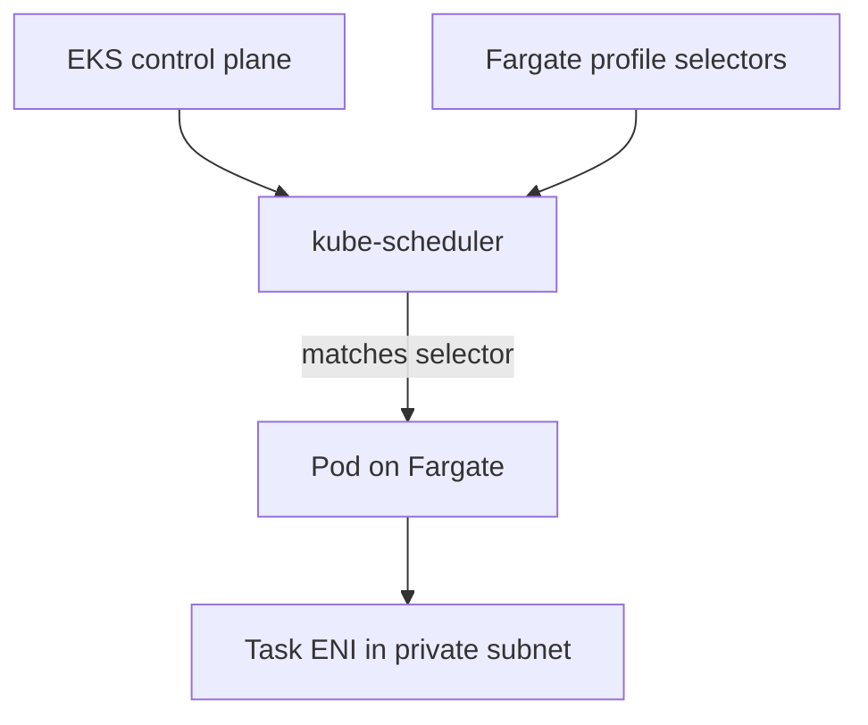

**Fargate on EKS** = Kubernetes schedules pods; AWS runs them on **Fargate** (no EC2 worker for those pods). You choose which pods via **Fargate profiles** (namespace + optional labels). This is different from [AWS Batch on Fargate](./aws-batch-fargate-quickstart.md), which uses job queues and job definitions.

**Time:** ~20 minutes for a minimal cluster + one app namespace.

## How it fits together



| Piece | Role |
| --- | --- |
| Fargate profile | Maps `namespace` (+ labels) → Fargate capacity |
| Pod execution role | Lets Fargate pull images and write logs (`eks-fargate-pods.amazonaws.com`) |
| Private subnets | Required for Fargate pods (with NAT or VPC endpoints) |
| Cluster security group | Traffic between control plane and pod ENIs |

Manifests: [`dir/eks-fargate/`](./dir/eks-fargate/) — [`fargate-cluster.yaml`](./dir/eks-fargate/fargate-cluster.yaml), [`deployment.yaml`](./dir/eks-fargate/deployment.yaml).

## Prerequisites

- `eksctl` **0.215.0+** (`eksctl version`)
- `kubectl` aligned with cluster version
- IAM rights for EKS, EC2 (VPC), and IAM roles

```bash
export AWS_REGION=us-east-1
export CLUSTER_NAME=fargate-demo
```

## Step 1 — Pod execution role

Fargate needs a role trusted by `eks-fargate-pods.amazonaws.com` with **`AmazonEKSFargatePodExecutionRolePolicy`**.

`eksctl` can create this when you pass `--pod-execution-role-arn` or use a config file. Manual create (once per account/region pattern):

```bash
cat > /tmp/fargate-pod-trust.json <<'EOF'
{
  "Version": "2012-10-17",
  "Statement": [{
    "Effect": "Allow",
    "Principal": { "Service": "eks-fargate-pods.amazonaws.com" },
    "Action": "sts:AssumeRole"
  }]
}
EOF

aws iam create-role \
  --role-name AmazonEKSFargatePodExecutionRole \
  --assume-role-policy-document file:///tmp/fargate-pod-trust.json 2>/dev/null || true

aws iam attach-role-policy \
  --role-name AmazonEKSFargatePodExecutionRole \
  --policy-arn arn:aws:iam::aws:policy/AmazonEKSFargatePodExecutionRolePolicy
```

## Step 2 — Create cluster with Fargate profiles

### Option A — eksctl config (recommended)

Edit region/version in [`fargate-cluster.yaml`](./dir/eks-fargate/fargate-cluster.yaml), then:

```bash
eksctl create cluster -f src/content/dir/eks-fargate/fargate-cluster.yaml
```

This example:

- **`fp-apps`** — pods in namespace `apps` with label `compute=fargate`
- **`fp-kube-system`** — CoreDNS (`k8s-app=kube-dns`) on Fargate
- **`system-ng`** — small managed node group for controllers/DaemonSets that cannot run on Fargate

### Option B — Fargate-only cluster flag

```bash
eksctl create cluster \
  --name "$CLUSTER_NAME" \
  --region "$AWS_REGION" \
  --fargate
```

That seeds profiles for **`default`** and **`kube-system`** only. Add more profiles for app namespaces.

### Option C — Existing cluster

```bash
eksctl create fargateprofile \
  --cluster "$CLUSTER_NAME" \
  --name fp-apps \
  --namespace apps \
  --labels compute=fargate
```

Profiles are **immutable** — change selectors by creating a new profile and deleting the old one after workloads move.

## Step 3 — Security groups and subnets

| Rule | Detail |
| --- | --- |
| Subnets | Fargate pods use **private** subnets from the profile (NAT for outbound, or VPC endpoints for ECR/S3/logs) |
| Pod ENI | Each pod gets an ENI; security groups come from the cluster config |
| Hybrid cluster | [AWS docs](https://docs.aws.amazon.com/eks/latest/userguide/fargate-profile.html): ensure **node security groups allow traffic to the cluster security group** so Fargate and EC2 pods can talk |

No extra inbound rules for a stateless `nginx` demo. For ALB Ingress, use the [AWS Load Balancer Controller](./eks-deploy-app-alb-autoscaling.md) and target-type `ip` on Fargate.

## Step 4 — Deploy a sample app

Create namespace and apply the deployment (labels must match the Fargate profile):

```bash
kubectl create namespace apps

kubectl apply -f src/content/dir/eks-fargate/deployment.yaml
```

Verify pods run on Fargate:

```bash
kubectl -n apps get pods -o wide
kubectl -n apps describe pod -l app=hello-fargate | grep -E 'Node:|fargate'
```

Fargate nodes look like `fargate-ip-10-20-x-x.region.compute.internal`.

```bash
kubectl -n apps run -it --rm debug --image=public.ecr.aws/docker/library/busybox:1.36 \
  --restart=Never -- wget -qO- http://hello-fargate.apps.svc.cluster.local
```

## Step 5 — CoreDNS on Fargate

If app pods stay `Pending` or DNS fails:

1. Confirm a profile selects **CoreDNS** in `kube-system` (label `k8s-app=kube-dns`), as in [`fargate-cluster.yaml`](./dir/eks-fargate/fargate-cluster.yaml).
2. Or keep CoreDNS on a **managed node group** and only run apps on Fargate.

After adding a profile, **recreate** CoreDNS pods so they match:

```bash
kubectl -n kube-system rollout restart deployment coredns
```

## What works / what does not

| Supported | Not supported on Fargate |
| --- | --- |
| Deployments, Jobs, most Services | **DaemonSets** (no host) |
| ALB Ingress (`target-type: ip`) | **Host network**, **privileged** containers |
| Horizontal Pod Autoscaler | **EBS volumes** attached to pod (use EFS) |
| IRSA (pod IAM roles) | GPU, **bare PodSecurityPolicy host paths** |

## Pitfalls

| Symptom | Likely cause | Fix |
| --- | --- | --- |
| Pod **Pending** (`eks-fargate-profile-not-found`) | No profile matches namespace/labels | Add profile or fix pod labels |
| Pod Pending (insufficient capacity) | Subnet/AZ or Fargate limits | Try another AZ in profile subnets; check quotas |
| **ImagePullBackOff** | No NAT/endpoints from private subnet | NAT gateway or ECR/S3 VPC endpoints |
| DNS failures | CoreDNS not on Fargate or not reachable | Fargate profile for `kube-dns` or run DNS on nodes |
| Changed profile has no effect | Profiles are immutable | Create new profile, migrate workloads, delete old |
| Old pods still on EC2 | Selector only applies at **schedule** time | Delete pods so they recreate |
| `eksctl create fargateprofile` fails on old cluster | Platform version / legacy stack | `eksctl upgrade cluster` per [eksctl docs](https://docs.aws.amazon.com/eks/latest/eksctl/fargate.html) |

## Cleanup

```bash
kubectl delete namespace apps
eksctl delete cluster --name "$CLUSTER_NAME" --region "$AWS_REGION"
```

## EKS Fargate vs other compute

| Model | You manage | Good for |
| --- | --- | --- |
| **Fargate profiles** | Profiles + pod sizing | Stateless apps, batch jobs, no node patching |
| **Managed node groups** | AMIs, scaling, DaemonSets | System agents, GPUs, EBS-heavy workloads |
| **EKS Auto Mode** | Less node plumbing | New clusters wanting AWS-managed compute (see [EKS getting started](./eks-getting-started.md)) |

## Next steps

- [AWS Load Balancer Controller + Ingress](./eks-deploy-app-alb-autoscaling.md) for public HTTP
- IRSA for S3/DynamoDB from Fargate pods
- Separate profiles per environment (`staging` / `production`) with label selectors

Official walkthrough: [Get started with AWS Fargate for your cluster](https://docs.aws.amazon.com/eks/latest/userguide/fargate-getting-started.html).
