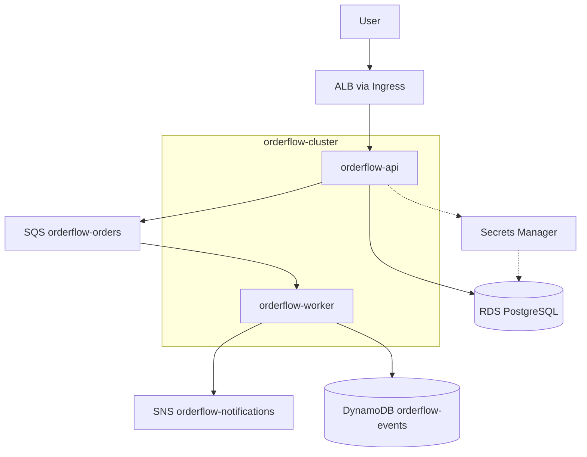

> Migrate ShopSphere from in-cluster PostgreSQL to managed RDS, Secrets Manager, and an event-driven pipeline with SQS, SNS, and DynamoDB on EKS.


## Migration at a glance

| ShopSphere (K8s-native) | OrderFlow (AWS-managed) |
|---------------------------|-------------------------|
| PostgreSQL StatefulSet + EBS | RDS PostgreSQL (`orderflow-db`) |
| Kubernetes Secrets in Git | Secrets Manager + IRSA |
| Synchronous API only | API → RDS + SQS → worker → SNS/DynamoDB |

## Final architecture



## Phase 01: 01-infrastructure-setup

## Objective

Create **OrderFlowVpc** with public and private subnets, an Internet Gateway, a NAT Gateway, and route tables that support EKS nodes in private subnets and internet-facing ALBs in public subnets.

## Architecture

```
VPC: 16.0.0.0/16 (OrderFlowVpc)
├── PublicSubnet1, PublicSubnet2
│   ├── Internet Gateway
│   ├── NAT Gateway
│   └── ALB (created later by ingress controller)
│
├── PrivateSubnet1, PrivateSubnet2
│   ├── EKS worker nodes
│   ├── Application pods
│   └── RDS (private subnets only)
│
└── Route tables
    ├── Public: 0.0.0.0/0 → IGW
    └── Private: 0.0.0.0/0 → NAT Gateway
```

## Commands

### Option A: eksctl (recommended)

```bash
eksctl create cluster \
  --name orderflow-cluster \
  --region us-east-1 \
  --version 1.35 \
  --without-nodegroup \
  --vpc-cidr 16.0.0.0/16 \
  --vpc-public-subnets 16.0.0.0/20,16.0.16.0/20 \
  --vpc-private-subnets 16.0.32.0/20,16.0.48.0/20
```

### Option B: tag existing subnets for ALB discovery

```bash
## Public subnets - internet-facing ALBs
aws ec2 create-tags \
  --resources subnet-PUBLIC1 subnet-PUBLIC2 \
  --tags \
    Key=kubernetes.io/cluster/orderflow-cluster,Value=shared \
    Key=kubernetes.io/role/elb,Value=1

## Private subnets - internal load balancers
aws ec2 create-tags \
  --resources subnet-PRIVATE1 subnet-PRIVATE2 \
  --tags \
    Key=kubernetes.io/cluster/orderflow-cluster,Value=shared \
    Key=kubernetes.io/role/internal-elb,Value=1
```

## Manifests

Subnet tags are not Kubernetes manifests but are required before Phase 05:

| Subnet type | Tag | Value |
|-------------|-----|-------|
| Public | `kubernetes.io/role/elb` | `1` |
| Private | `kubernetes.io/role/internal-elb` | `1` |
| Both | `kubernetes.io/cluster/orderflow-cluster` | `shared` |

## Verification

```bash
aws ec2 describe-vpcs \
  --filters "Name=tag:Name,Values=OrderFlowVpc" \
  --query 'Vpcs[*].{Id:VpcId,Cidr:CidrBlock}'

aws ec2 describe-subnets \
  --filters "Name=vpc-id,Values=$VPC_ID" \
  --query 'Subnets[*].{Id:SubnetId,Az:AvailabilityZone,Tags:Tags}'

aws ec2 describe-nat-gateways \
  --filter "Name=vpc-id,Values=$VPC_ID" \
  --query 'NatGateways[*].State'
```

**Expected:** one VPC `16.0.0.0/16`, two public and two private subnets, NAT Gateway `available`, public route to IGW, private route to NAT.

## Troubleshooting

### Private nodes cannot pull images

**Symptoms:** `ErrImagePull` / `ImagePullBackOff` on pods in private subnets.

**Fix:** Confirm NAT Gateway is in a **public** subnet and the private route table has `0.0.0.0/0 → nat-xxx`.

```bash
aws ec2 describe-route-tables \
  --filters "Name=vpc-id,Values=$VPC_ID" \
  --query 'RouteTables[*].Routes'
```

---

## Phase 02: 02-eks-cluster

## Objective

Create **orderflow-cluster** (Kubernetes 1.35) with a managed node group in private subnets, control-plane logging enabled, and an OIDC provider for IRSA.

## Architecture

```
orderflow-cluster (EKS 1.35)
├── Control plane (public + private endpoint)
├── Managed node group: primary-ng
│   ├── Instance type: t3.small
│   ├── Scaling: min 2, desired 2, max 4
│   └── Subnets: private only
└── OIDC provider → IRSA (Phases 05, 09, 13)
```

## Commands

### Create node group (if cluster created with --without-nodegroup)

```bash
eksctl create nodegroup \
  --cluster orderflow-cluster \
  --region us-east-1 \
  --name primary-ng \
  --node-type t3.small \
  --nodes 2 \
  --nodes-min 2 \
  --nodes-max 4 \
  --node-private-networking
```

### Enable control-plane logging

```bash
aws eks update-cluster-config \
  --name orderflow-cluster \
  --logging '{"clusterLogging":[{"types":["api","audit","authenticator","controllerManager","scheduler"],"enabled":true}]}'
```

### Associate OIDC provider

```bash
eksctl utils associate-iam-oidc-provider \
  --cluster orderflow-cluster \
  --region us-east-1 \
  --approve
```

### Configure kubectl

```bash
aws eks update-kubeconfig --name orderflow-cluster --region us-east-1
kubectl get nodes -o wide
```

## Manifests

No application manifests in this phase. Cluster logging and endpoint access are AWS API settings.

## Verification

```bash
aws eks describe-cluster --name orderflow-cluster \
  --query 'cluster.{Status:status,Version:version,OIDC:identity.oidc.issuer,Logging:logging.clusterLogging}'

aws iam list-open-id-connect-providers | grep orderflow-cluster

kubectl get nodes
## Expected: 2 nodes, STATUS Ready, internal IPs in private CIDR
```

## Troubleshooting

### Nodes NotReady

```bash
kubectl describe node <node-name>
aws ec2 describe-instances --filters "Name=tag:eks:nodegroup-name,Values=primary-ng"
```

Common causes: insufficient subnet IP space, missing NAT (Phase 01), or security group blocking node communication.

### OIDC provider missing

IRSA and the ALB controller fail without OIDC. Re-run `eksctl utils associate-iam-oidc-provider` and verify the issuer URL matches the cluster describe output.

## Phase 03: 03-ebs-csi-storage

## Objective

Install the **EBS CSI Driver** as an EKS managed add-on (EKS Pod Identity) and define a **gp3** StorageClass for any pod-local volumes the API or worker need.

## Architecture

```
EKS Pod Identity
  → EBS CSI controller (kube-system)
  → gp3 StorageClass
  → PVC → EBS volume (when workloads request storage)
```

OrderFlow persists orders in **RDS**, not cluster volumes - but gp3 remains useful for temp/cache volumes and mirrors ShopSphere storage patterns.

## Commands

### Install EBS CSI add-on

```bash
aws eks create-addon \
  --cluster-name orderflow-cluster \
  --addon-name aws-ebs-csi-driver \
  --resolve-conflicts OVERWRITE

kubectl get pods -n kube-system -l app.kubernetes.io/name=aws-ebs-csi-driver
```

## Manifests

### gp3 StorageClass

```yaml
apiVersion: storage.k8s.io/v1
kind: StorageClass
metadata:
  name: gp3
  annotations:
    storageclass.kubernetes.io/is-default-class: "false"
provisioner: ebs.csi.aws.com
volumeBindingMode: WaitForFirstConsumer
allowVolumeExpansion: true
parameters:
  type: gp3
  encrypted: "true"
```

```bash
kubectl apply -f storageclass-gp3.yaml
```

## Verification

```bash
kubectl get storageclass gp3
kubectl get pods -n kube-system | grep ebs-csi
## Expected: ebs-csi-controller and ebs-csi-node pods Running
```

## Troubleshooting

### PVC stays Pending

**Cause:** `WaitForFirstConsumer` delays binding until a pod is scheduled. Ensure a pod references the PVC and runs in a node AZ with available capacity.

### CSI pods CrashLoopBackOff

Verify the add-on version matches the cluster Kubernetes version and that Pod Identity / IAM permissions for the CSI service account are attached.

## Phase 04: 04-ecr-repositories

## Objective

Create ECR repositories for **orderflow/api**, **orderflow/frontend**, and **orderflow/worker** with image scanning on push and an immutable tagging strategy.

## Architecture

```
Developer workstation
  → docker build
  → ECR (scan on push)
  → EKS pulls via node IAM / private NAT
  → Deployments reference immutable tags (v1, git SHA)
```

## Commands

### Create repositories

```bash
for REPO in orderflow/api orderflow/frontend orderflow/worker; do
  aws ecr create-repository \
    --repository-name "$REPO" \
    --image-scanning-configuration scanOnPush=true \
    --encryption-configuration encryptionType=AES256
done
```

### Login and push API image

```bash
export AWS_ACCOUNT_ID=$(aws sts get-caller-identity --query Account --output text)
export REGION=us-east-1

aws ecr get-login-password --region $REGION | \
  docker login --username AWS --password-stdin \
  $AWS_ACCOUNT_ID.dkr.ecr.$REGION.amazonaws.com

docker build -t orderflow-api:v1 ./api
docker tag orderflow-api:v1 \
  $AWS_ACCOUNT_ID.dkr.ecr.$REGION.amazonaws.com/orderflow/api:v1
docker push $AWS_ACCOUNT_ID.dkr.ecr.$REGION.amazonaws.com/orderflow/api:v1
```

Repeat for `orderflow/frontend` and `orderflow/worker` when those Dockerfiles are ready.

## Manifests

Deployment image references (used in Phases 06 and 13):

```yaml
image: ACCOUNT_ID.dkr.ecr.us-east-1.amazonaws.com/orderflow/api:v1
imagePullPolicy: IfNotPresent
```

## Verification

```bash
aws ecr describe-repositories \
  --query 'repositories[?starts_with(repositoryName, `orderflow/`)].repositoryName'

aws ecr describe-image-scan-findings \
  --repository-name orderflow/api \
  --image-id imageTag=v1 \
  --query 'imageScanFindings.findingSeverityCounts'
```

## Troubleshooting

### ImagePullBackOff after push

- Confirm tag in Deployment matches the pushed tag exactly (`v1`, not `latest`).
- Verify NAT connectivity from private nodes (Phase 01).
- Check ECR repository policy allows the node/instance role to pull.

## Phase 05: 05-aws-load-balancer-controller

## Objective

Install the **AWS Load Balancer Controller** on **orderflow-cluster** using IRSA so Ingress resources provision Application Load Balancers automatically.

## Architecture

```
Ingress (orderflow namespace)
  → AWS Load Balancer Controller (kube-system, IRSA)
  → AWS ELB APIs
  → Internet-facing ALB → Target Group (pod IPs)
```

## Commands

### Download and create IAM policy

```bash
curl -fsSL -o iam_policy.json \
  https://raw.githubusercontent.com/kubernetes-sigs/aws-load-balancer-controller/v2.7.0/docs/install/iam_policy.json

aws iam create-policy \
  --policy-name AWSLoadBalancerControllerOrderFlowPolicy \
  --policy-document file://iam_policy.json

export POLICY_ARN=$(aws iam list-policies \
  --query "Policies[?PolicyName=='AWSLoadBalancerControllerOrderFlowPolicy'].Arn" \
  --output text)
```

### Create IRSA service account

```bash
eksctl create iamserviceaccount \
  --cluster=orderflow-cluster \
  --namespace=kube-system \
  --name=aws-load-balancer-controller \
  --attach-policy-arn=$POLICY_ARN \
  --override-existing-serviceaccounts \
  --approve
```

### Install via Helm

```bash
helm repo add eks https://aws.github.io/eks-charts
helm repo update

export VPC_ID=$(aws eks describe-cluster --name orderflow-cluster \
  --query "cluster.resourcesVpcConfig.vpcId" --output text)

helm install aws-load-balancer-controller eks/aws-load-balancer-controller \
  -n kube-system \
  --set clusterName=orderflow-cluster \
  --set serviceAccount.create=false \
  --set serviceAccount.name=aws-load-balancer-controller \
  --set region=us-east-1 \
  --set vpcId=$VPC_ID \
  --set replicaCount=2
```

## Manifests

No Ingress yet - that is Phase 07. Confirm the controller Deployment references the IRSA service account.

## Verification

```bash
kubectl get deployment -n kube-system aws-load-balancer-controller
kubectl logs -n kube-system deployment/aws-load-balancer-controller --tail=30
## Expected: manager started, no AccessDenied on ec2:DescribeSubnets
```

## Troubleshooting

### No subnets found

Subnet tags from Phase 01 are missing. Re-apply `kubernetes.io/role/elb=1` on public subnets.

### AccessDenied in controller logs

Re-create the IRSA service account and confirm trust policy `sub` matches `system:serviceaccount:kube-system:aws-load-balancer-controller`.

## Phase 06: 06-api-deployment

## Objective

Deploy the **orderflow-api** Flask/Gunicorn application into the **orderflow** namespace with a **ClusterIP** Service. Database and secrets wiring come in Phases 09–10.

## Architecture

```
orderflow namespace
├── Deployment: orderflow-api (replicas: 2)
├── Service: orderflow-api-service (ClusterIP :5000)
└── ConfigMap: orderflow-api-config (non-secret env, Phase 10)
```

## Commands

```bash
kubectl create namespace orderflow

kubectl apply -f k8s/api-deployment.yaml
kubectl apply -f k8s/api-service.yaml

kubectl rollout status deployment/orderflow-api -n orderflow
kubectl get pods,svc -n orderflow
```

## Manifests

### Deployment

```yaml
apiVersion: apps/v1
kind: Deployment
metadata:
  name: orderflow-api
  namespace: orderflow
  labels:
    app: orderflow-api
spec:
  replicas: 2
  selector:
    matchLabels:
      app: orderflow-api
  template:
    metadata:
      labels:
        app: orderflow-api
    spec:
      serviceAccountName: orderflow-api
      containers:
        - name: api
          image: ACCOUNT_ID.dkr.ecr.us-east-1.amazonaws.com/orderflow/api:v1
          ports:
            - containerPort: 5000
          envFrom:
            - configMapRef:
                name: orderflow-api-config
          readinessProbe:
            httpGet:
              path: /health
              port: 5000
            initialDelaySeconds: 10
            periodSeconds: 10
          livenessProbe:
            httpGet:
              path: /health
              port: 5000
            initialDelaySeconds: 30
            periodSeconds: 20
          resources:
            requests:
              cpu: 100m
              memory: 256Mi
            limits:
              cpu: 500m
              memory: 512Mi
```

### Service

```yaml
apiVersion: v1
kind: Service
metadata:
  name: orderflow-api-service
  namespace: orderflow
spec:
  type: ClusterIP
  selector:
    app: orderflow-api
  ports:
    - port: 80
      targetPort: 5000
      protocol: TCP
```

> **Note:** `serviceAccountName: orderflow-api` requires the IRSA service account from Phase 09. For initial image-only testing, use `default` temporarily, then switch after IRSA is created.

## Verification

```bash
kubectl port-forward svc/orderflow-api-service 8080:80 -n orderflow
curl -s http://localhost:8080/health
## Expected: {"status":"ok"} or HTTP 200
```

## Troubleshooting

### CrashLoopBackOff before RDS is configured

Expected until Phases 08–10 complete. Check logs:

```bash
kubectl logs deployment/orderflow-api -n orderflow --tail=50
```

If the app requires `DB_HOST` at startup, add placeholder ConfigMap values or defer readiness until RDS is reachable.

## Phase 07: 07-ingress-configuration

## Objective

Expose the API through **orderflow-ingress**, letting the AWS Load Balancer Controller provision an internet-facing ALB with health checks on `/health`.

## Architecture

```
Internet
  → ALB (internet-facing)
  → Target group (pod IPs, HTTP :5000)
  → orderflow-api-service
  → orderflow-api pods
```

## Commands

```bash
kubectl apply -f k8s/ingress.yaml

kubectl get ingress -n orderflow -w
## Wait until ADDRESS column shows ALB hostname

export ALB=$(kubectl get ingress orderflow-ingress -n orderflow \
  -o jsonpath='{.status.loadBalancer.ingress[0].hostname}')
curl -s "http://${ALB}/health"
```

## Manifests

```yaml
apiVersion: networking.k8s.io/v1
kind: Ingress
metadata:
  name: orderflow-ingress
  namespace: orderflow
  annotations:
    alb.ingress.kubernetes.io/scheme: internet-facing
    alb.ingress.kubernetes.io/target-type: ip
    alb.ingress.kubernetes.io/healthcheck-path: /health
    alb.ingress.kubernetes.io/listen-ports: '[{"HTTP": 80}]'
spec:
  ingressClassName: alb
  rules:
    - http:
        paths:
          - path: /
            pathType: Prefix
            backend:
              service:
                name: orderflow-api-service
                port:
                  number: 80
```

When the frontend is deployed, add a second path rule for `/` static content and `/api/*` to the API - mirror [ShopSphere ingress](/shopsphere-on-eks/#phase-09-09-ingress-configuration).

## Verification

```bash
kubectl describe ingress orderflow-ingress -n orderflow
aws elbv2 describe-load-balancers \
  --query 'LoadBalancers[?contains(LoadBalancerName, `k8s-orderflow`)].{Name:LoadBalancerName,DNS:DNSName,State:State.Code}'

curl -s -o /dev/null -w "%{http_code}" "http://${ALB}/health"
## Expected: 200
```

## Troubleshooting

### Ingress has no ADDRESS

1. Controller pods running? (Phase 05)
2. Subnet tags correct? (Phase 01)
3. Check events: `kubectl describe ingress orderflow-ingress -n orderflow`

### ALB targets unhealthy

Verify readiness probe on `/health` and security groups allow node → pod traffic on port 5000.

## Phase 08: 08-rds-postgresql

## Objective

Provision **orderflow-db** (PostgreSQL) in private subnets with **no public access**, secured so only EKS nodes can reach port **5432**.

## Architecture

```
orderflow-api pods (private subnets)
  → RDS security group (5432 from node SG)
  → orderflow-db (PostgreSQL, Multi-AZ optional)
  → AWS-managed master secret in Secrets Manager
```

## Commands

### Create DB subnet group and instance

```bash
aws rds create-db-subnet-group \
  --db-subnet-group-name orderflow-db-subnets \
  --db-subnet-group-description "OrderFlow private subnets" \
  --subnet-ids subnet-PRIVATE1 subnet-PRIVATE2

aws rds create-db-instance \
  --db-instance-identifier orderflow-db \
  --db-instance-class db.t3.micro \
  --engine postgres \
  --master-username orderflow \
  --manage-master-user-password \
  --allocated-storage 20 \
  --vpc-security-group-ids sg-RDS \
  --db-subnet-group-name orderflow-db-subnets \
  --no-publicly-accessible \
  --backup-retention-period 7
```

### Allow nodes to reach RDS

```bash
## Get EKS node security group
NODE_SG=$(aws eks describe-cluster --name orderflow-cluster \
  --query 'cluster.resourcesVpcConfig.clusterSecurityGroupId' --output text)

aws ec2 authorize-security-group-ingress \
  --group-id sg-RDS \
  --protocol tcp \
  --port 5432 \
  --source-group $NODE_SG
```

### Connectivity test from cluster

```bash
kubectl run postgres-client -n orderflow --image=postgres:17 --restart=Never -- sleep infinity

kubectl exec -it postgres-client -n orderflow -- \
  pg_isready -h orderflow-db.xxxx.us-east-1.rds.amazonaws.com -p 5432

kubectl delete pod postgres-client -n orderflow
```

## Manifests

RDS is provisioned via AWS API/Console - no Kubernetes manifests. Record endpoint and port for the ConfigMap in Phase 10:

```
DB_HOST=orderflow-db.xxxx.us-east-1.rds.amazonaws.com
DB_PORT=5432
DB_NAME=orderflowdb
```

## Verification

```bash
aws rds describe-db-instances --db-instance-identifier orderflow-db \
  --query 'DBInstances[0].{Status:DBInstanceStatus,Endpoint:Endpoint.Address,Public:PubliclyAccessible}'

## Expected: available, PubliclyAccessible=false
```

## Troubleshooting

### Connection timeout from pods

- RDS SG must allow **node security group**, not `0.0.0.0/0`.
- Confirm RDS subnets are the same VPC as the cluster.
- Verify route tables allow node → RDS within VPC (local routes).

### pg_isready fails

Check NACLs and that the client pod runs in the **orderflow** namespace with network policies allowing egress to RDS.

## Phase 09: 09-secrets-manager-irsa

## Objective

Grant the API pods permission to read the **RDS master secret** from Secrets Manager using **IRSA** - no long-lived AWS keys or Kubernetes secret objects in Git.

## Architecture

```
orderflow-api pod
  → service account orderflow-api (IRSA)
  → OrderFlowApiRole
  → secretsmanager:GetSecretValue (RDS secret only)
  → psycopg2/SQLAlchemy connection to RDS
```

## Commands

### Create least-privilege policy

```bash
export SECRET_ARN=$(aws rds describe-db-instances \
  --db-instance-identifier orderflow-db \
  --query 'DBInstances[0].MasterUserSecret.SecretArn' --output text)

cat > orderflow-api-secrets-policy.json <<EOF
{
  "Version": "2012-10-17",
  "Statement": [{
    "Effect": "Allow",
    "Action": ["secretsmanager:GetSecretValue", "secretsmanager:DescribeSecret"],
    "Resource": "$SECRET_ARN"
  }]
}
EOF

aws iam create-policy \
  --policy-name OrderFlowApiSecretsPolicy \
  --policy-document file://orderflow-api-secrets-policy.json
```

### Create IRSA service account

```bash
eksctl create iamserviceaccount \
  --cluster orderflow-cluster \
  --namespace orderflow \
  --name orderflow-api \
  --role-name OrderFlowApiRole \
  --attach-policy-arn arn:aws:iam::ACCOUNT_ID:policy/OrderFlowApiSecretsPolicy \
  --approve
```

### Roll API to pick up service account

```bash
kubectl rollout restart deployment/orderflow-api -n orderflow
kubectl describe pod -n orderflow -l app=orderflow-api | grep -E 'AWS_ROLE_ARN|AWS_WEB_IDENTITY'
```

## Manifests

### API secret-fetch pattern (application code)

```python
import boto3
import json
import os

def get_db_credentials():
    client = boto3.client("secretsmanager", region_name=os.environ["AWS_REGION"])
    resp = client.get_secret_value(SecretId=os.environ["DB_SECRET_ARN"])
    secret = json.loads(resp["SecretString"])
    return secret["username"], secret["password"]
```

### ConfigMap (non-secret only)

```yaml
apiVersion: v1
kind: ConfigMap
metadata:
  name: orderflow-api-config
  namespace: orderflow
data:
  DB_HOST: "orderflow-db.xxxx.us-east-1.rds.amazonaws.com"
  DB_PORT: "5432"
  DB_NAME: "orderflowdb"
  DB_SECRET_ARN: "arn:aws:secretsmanager:us-east-1:ACCOUNT:secret:rds!..."
  AWS_REGION: "us-east-1"
```

## Verification

```bash
kubectl exec -it deployment/orderflow-api -n orderflow -- env | grep AWS_
## Expected: AWS_ROLE_ARN, AWS_WEB_IDENTITY_TOKEN_FILE

kubectl exec -it deployment/orderflow-api -n orderflow -- \
  python -c "import boto3; print(boto3.client('sts').get_caller-identity())"
## Expected: Arn contains OrderFlowApiRole
```

## Troubleshooting

### AccessDenied on GetSecretValue

- Policy `Resource` must match the exact secret ARN.
- Pod must use `serviceAccountName: orderflow-api`, not `default`.
- Confirm OIDC provider exists (Phase 02).

### No AWS_ROLE_ARN on pod

Deployment spec missing `serviceAccountName` or service account created in wrong namespace.

## Phase 10: 10-api-database-integration

## Objective

Wire the Flask API to RDS: create the **orders** table, expose **GET/POST /orders**, and confirm end-to-end persistence through the ALB.

## Architecture

```
POST /orders
  → validate payload
  → INSERT into orders (RDS)
  → return 201 + order_id
  (SQS enqueue added in Phase 11)
```

## Commands

### Apply ConfigMap and restart API

```bash
kubectl apply -f k8s/api-configmap.yaml
kubectl rollout restart deployment/orderflow-api -n orderflow
```

### Smoke test via ALB

```bash
export ALB=$(kubectl get ingress orderflow-ingress -n orderflow \
  -o jsonpath='{.status.loadBalancer.ingress[0].hostname}')

curl -s "http://${ALB}/health"
curl -s "http://${ALB}/orders"
curl -s -X POST "http://${ALB}/orders" \
  -H "Content-Type: application/json" \
  -d '{"order_id":"ord-001","status":"CREATED"}'
curl -s "http://${ALB}/orders"
```

### Verify row in RDS

```bash
kubectl run postgres-client -n orderflow --image=postgres:17 --restart=Never -- sleep infinity
kubectl exec -it postgres-client -n orderflow -- \
  psql -h $DB_HOST -U orderflow -d orderflowdb -c "SELECT * FROM orders;"
kubectl delete pod postgres-client -n orderflow
```

## Manifests

### Schema (run once at app startup or migration job)

```sql
CREATE TABLE IF NOT EXISTS orders (
    id SERIAL PRIMARY KEY,
    order_id VARCHAR(50) UNIQUE NOT NULL,
    status VARCHAR(50) NOT NULL,
    created_at TIMESTAMP DEFAULT CURRENT_TIMESTAMP
);
```

### Flask route sketch

```python
@app.route("/orders", methods=["GET"])
def list_orders():
    rows = db.session.execute(text("SELECT order_id, status, created_at FROM orders ORDER BY id DESC LIMIT 50"))
    return jsonify([dict(r._mapping) for r in rows])

@app.route("/orders", methods=["POST"])
def create_order():
    data = request.get_json(force=True)
    db.session.execute(
        text("INSERT INTO orders (order_id, status) VALUES (:oid, :st)"),
        {"oid": data["order_id"], "st": data.get("status", "CREATED")},
    )
    db.session.commit()
    return jsonify(data), 201
```

## Verification

| Check | Expected |
|-------|----------|
| `GET /health` | HTTP 200 |
| `GET /orders` | `[]` or list of orders |
| `POST /orders` | HTTP 201, row in RDS |
| API logs | No `password authentication failed` |

```bash
kubectl logs deployment/orderflow-api -n orderflow --tail=30
```

## Troubleshooting

### SSL required by RDS

Add `?sslmode=require` to the SQLAlchemy URL or set `sslmode` in the Postgres driver options.

### Unique violation on order_id

Expected if re-posting the same `order_id` - return HTTP 409 in production.

## Phase 11: 11-sqs-integration

## Objective

Create **orderflow-orders** (SQS) and extend the API so every successful `POST /orders` enqueues a message for asynchronous processing.

## Architecture

```
POST /orders
  → INSERT orders (RDS) - synchronous
  → SendMessage (SQS orderflow-orders) - synchronous
  → HTTP 201 to client
  → Worker consumes later (Phase 13)
```

## Commands

### Create queue

```bash
aws sqs create-queue \
  --queue-name orderflow-orders \
  --attributes '{
    "VisibilityTimeout": "60",
    "MessageRetentionPeriod": "345600",
    "ReceiveMessageWaitTimeSeconds": "20"
  }'

export QUEUE_URL=$(aws sqs get-queue-url \
  --queue-name orderflow-orders --query QueueUrl --output text)
```

### Grant API permission to send messages

Add to **OrderFlowApiSecretsPolicy** or a separate **OrderFlowApiSqsPolicy**:

```json
{
  "Effect": "Allow",
  "Action": ["sqs:SendMessage", "sqs:GetQueueUrl"],
  "Resource": "arn:aws:sqs:us-east-1:ACCOUNT_ID:orderflow-orders"
}
```

```bash
aws iam attach-role-policy \
  --role-name OrderFlowApiRole \
  --policy-arn arn:aws:iam::ACCOUNT_ID:policy/OrderFlowApiSqsPolicy
```

### Test enqueue

```bash
curl -s -X POST "http://${ALB}/orders" \
  -H "Content-Type: application/json" \
  -d '{"order_id":"ord-002","status":"CREATED"}'

aws sqs get-queue-attributes \
  --queue-url $QUEUE_URL \
  --attribute-names ApproximateNumberOfMessages
```

## Manifests

### ConfigMap addition

```yaml
data:
  SQS_QUEUE_URL: "https://sqs.us-east-1.amazonaws.com/ACCOUNT_ID/orderflow-orders"
```

### API enqueue snippet

```python
import boto3, json, os

sqs = boto3.client("sqs", region_name=os.environ["AWS_REGION"])

def enqueue_order(order_id: str, status: str):
    sqs.send_message(
        QueueUrl=os.environ["SQS_QUEUE_URL"],
        MessageBody=json.dumps({"order_id": order_id, "status": status}),
    )
```

Call `enqueue_order()` after successful DB commit in `create_order()`.

## Verification

```bash
aws sqs receive-message --queue-url $QUEUE_URL --max-number-of-messages 1
## Expected: body contains order_id from POST /orders
```

## Troubleshooting

### Message not appearing after POST

- API role missing `sqs:SendMessage`.
- Wrong `SQS_QUEUE_URL` in ConfigMap (region/account mismatch).
- API returns 201 but enqueue runs after failed commit - check transaction order in code.

### Duplicate messages on client retry

Use a deduplication id or idempotency key on `order_id` if clients may retry POST.

## Phase 12: 12-sns-dynamodb

## Objective

Create **orderflow-notifications** (SNS) and **orderflow-events** (DynamoDB) - the worker publishes notifications and stores processed events (Phase 13).

## Architecture

```
Worker (Phase 13)
  → sns:Publish → orderflow-notifications
  → dynamodb:PutItem → orderflow-events (PK: eventId)
```

## Commands

### SNS topic

```bash
aws sns create-topic --name orderflow-notifications

export TOPIC_ARN=$(aws sns list-topics \
  --query "Topics[?contains(TopicArn, 'orderflow-notifications')].TopicArn" \
  --output text)

## Optional: email subscription for lab alerts
aws sns subscribe \
  --topic-arn $TOPIC_ARN \
  --protocol email \
  --notification-endpoint you@example.com
```

### DynamoDB table

```bash
aws dynamodb create-table \
  --table-name orderflow-events \
  --attribute-definitions AttributeName=eventId,AttributeType=S \
  --key-schema AttributeName=eventId,KeyType=HASH \
  --billing-mode PAY_PER_REQUEST

aws dynamodb wait table-exists --table-name orderflow-events
```

### Worker IAM policy (preview - applied in Phase 13)

```json
{
  "Version": "2012-10-17",
  "Statement": [
    {
      "Effect": "Allow",
      "Action": ["sqs:ReceiveMessage", "sqs:DeleteMessage", "sqs:GetQueueAttributes"],
      "Resource": "arn:aws:sqs:us-east-1:ACCOUNT_ID:orderflow-orders"
    },
    {
      "Effect": "Allow",
      "Action": "sns:Publish",
      "Resource": "TOPIC_ARN"
    },
    {
      "Effect": "Allow",
      "Action": "dynamodb:PutItem",
      "Resource": "arn:aws:dynamodb:us-east-1:ACCOUNT_ID:table/orderflow-events"
    }
  ]
}
```

## Manifests

### Example DynamoDB item shape

```json
{
  "eventId": "evt-ord-002-20260609",
  "orderId": "ord-002",
  "status": "PROCESSED",
  "processedAt": "2026-06-09T12:00:00Z"
}
```

### Example SNS message

```json
{
  "order_id": "ord-002",
  "status": "PROCESSED",
  "message": "Order fulfillment complete"
}
```

## Verification

```bash
aws dynamodb describe-table --table-name orderflow-events \
  --query 'Table.{Name:TableName,Status:TableStatus,Billing:BillingModeSummary.BillingMode}'

aws sns get-topic-attributes --topic-arn $TOPIC_ARN
```

After Phase 13 worker runs, confirm items appear:

```bash
aws dynamodb scan --table-name orderflow-events --max-items 5
```

## Troubleshooting

### PutItem AccessDenied

Worker role missing `dynamodb:PutItem` on the table ARN (not `*`).

### SNS publish succeeds but no email

Confirm subscription status is **Confirmed** in the SNS console.

## Phase 13: 13-worker-deployment

## Objective

Deploy **orderflow-worker** with **OrderFlowWorkerRole** (IRSA) to poll SQS, publish SNS notifications, write DynamoDB events, and delete messages on success.

## Architecture

```
orderflow-orders (SQS)
  → orderflow-worker Deployment
      1. ReceiveMessage (long poll)
      2. Publish → orderflow-notifications
      3. PutItem → orderflow-events
      4. DeleteMessage
```

## Commands

### Create worker IAM policy and IRSA

```bash
aws iam create-policy \
  --policy-name OrderFlowWorkerPolicy \
  --policy-document file://orderflow-worker-policy.json

eksctl create iamserviceaccount \
  --cluster orderflow-cluster \
  --namespace orderflow \
  --name orderflow-worker \
  --role-name OrderFlowWorkerRole \
  --attach-policy-arn arn:aws:iam::ACCOUNT_ID:policy/OrderFlowWorkerPolicy \
  --approve
```

### Deploy worker

```bash
kubectl apply -f k8s/worker-deployment.yaml
kubectl rollout status deployment/orderflow-worker -n orderflow
kubectl logs -f deployment/orderflow-worker -n orderflow
```

### End-to-end test

```bash
curl -s -X POST "http://${ALB}/orders" \
  -H "Content-Type: application/json" \
  -d '{"order_id":"ord-e2e-001","status":"CREATED"}'

aws sqs get-queue-attributes --queue-url $QUEUE_URL \
  --attribute-names ApproximateNumberOfMessages

aws dynamodb scan --table-name orderflow-events \
  --filter-expression "orderId = :oid" \
  --expression-attribute-values '{":oid":{"S":"ord-e2e-001"}}'
```

## Manifests

### Deployment

```yaml
apiVersion: apps/v1
kind: Deployment
metadata:
  name: orderflow-worker
  namespace: orderflow
spec:
  replicas: 1
  selector:
    matchLabels:
      app: orderflow-worker
  template:
    metadata:
      labels:
        app: orderflow-worker
    spec:
      serviceAccountName: orderflow-worker
      containers:
        - name: worker
          image: ACCOUNT_ID.dkr.ecr.us-east-1.amazonaws.com/orderflow/worker:v1
          env:
            - name: SQS_QUEUE_URL
              value: "https://sqs.us-east-1.amazonaws.com/ACCOUNT_ID/orderflow-orders"
            - name: SNS_TOPIC_ARN
              value: "arn:aws:sns:us-east-1:ACCOUNT_ID:orderflow-notifications"
            - name: DYNAMODB_TABLE
              value: "orderflow-events"
            - name: AWS_REGION
              value: "us-east-1"
          resources:
            requests:
              cpu: 100m
              memory: 256Mi
```

### Worker loop (Python sketch)

```python
import boto3, json, uuid, os, time

sqs = boto3.client("sqs")
sns = boto3.client("sns")
ddb = boto3.client("dynamodb")

while True:
    resp = sqs.receive_message(
        QueueUrl=os.environ["SQS_QUEUE_URL"],
        MaxNumberOfMessages=1,
        WaitTimeSeconds=20,
    )
    for msg in resp.get("Messages", []):
        body = json.loads(msg["Body"])
        order_id = body["order_id"]
        event_id = f"evt-{order_id}-{uuid.uuid4().hex[:8]}"

        sns.publish(
            TopicArn=os.environ["SNS_TOPIC_ARN"],
            Message=json.dumps({"order_id": order_id, "status": "PROCESSED"}),
        )
        ddb.put_item(
            TableName=os.environ["DYNAMODB_TABLE"],
            Item={
                "eventId": {"S": event_id},
                "orderId": {"S": order_id},
                "status": {"S": "PROCESSED"},
            },
        )
        sqs.delete_message(
            QueueUrl=os.environ["SQS_QUEUE_URL"],
            ReceiptHandle=msg["ReceiptHandle"],
        )
```

## Verification

| Step | Expected |
|------|----------|
| POST /orders | HTTP 201 |
| SQS depth | Returns to 0 after worker processes |
| DynamoDB | Item with matching `orderId` |
| Worker logs | `Processed ord-e2e-001` or equivalent |

## Troubleshooting

### Messages reappear after processing

DeleteMessage failing - check `sqs:DeleteMessage` on the queue ARN. Visibility timeout may be too short if processing exceeds 60s.

### Worker idle, queue depth grows

- Wrong queue URL in Deployment env.
- IRSA role not attached to `orderflow-worker` service account.
- Worker image crash - `kubectl logs` for stack traces.

## Phase 14: 14-cloudwatch-observability

## Objective

Install the **Amazon CloudWatch Observability** EKS add-on for container logs, Container Insights metrics, and a baseline for debugging API and worker issues.

## Architecture

```
orderflow-api / orderflow-worker pods
  → CloudWatch agent (DaemonSet)
  → Log groups /metrics in CloudWatch
  → Container Insights dashboards
```

## Commands

### Install add-on

```bash
aws eks create-addon \
  --cluster-name orderflow-cluster \
  --addon-name amazon-cloudwatch-observability \
  --resolve-conflicts OVERWRITE

kubectl get pods -n amazon-cloudwatch
```

### Tail API logs

```bash
aws logs tail /aws/containerinsights/orderflow-cluster/application \
  --follow --filter-pattern "orderflow-api"
```

### Useful kubectl checks

```bash
kubectl top pods -n orderflow
kubectl logs deployment/orderflow-api -n orderflow --since=1h
kubectl logs deployment/orderflow-worker -n orderflow --since=1h
```

## Manifests

No custom manifests required for the managed add-on. Optional: structured JSON logging in the app for easier CloudWatch Logs Insights queries:

```python
import json, logging
logging.basicConfig(format="%(message)s", level=logging.INFO)
logger = logging.getLogger("orderflow")
logger.info(json.dumps({"event": "order_created", "order_id": order_id}))
```

## Verification

```bash
kubectl get pods -n amazon-cloudwatch
## Expected: fluent-bit / cloudwatch-agent pods Running on each node

aws logs describe-log-groups \
  --log-group-name-prefix /aws/containerinsights/orderflow-cluster
```

## Troubleshooting

### No logs in CloudWatch

- Add-on pods not Running on all nodes.
- IAM permissions for the add-on service account missing (check EKS add-on status).
- Wrong log group region - match cluster Region.

### High log volume cost

Set retention on log groups and filter noisy health-check lines at the app or collector level.

## Phase 15: 15-roadmap

## Objective

Document the next production hardening steps not completed in the core 14 phases: edge delivery, WAF, automated deploys, and domain events via EventBridge.

## Architecture (target state)

```
User
  → CloudFront
  → WAF
  → Frontend ALB
  → orderflow-frontend

API ALB → orderflow-api (existing)

Worker → EventBridge (planned)
  → Rules → Lambda / SNS / audit targets
```

## CloudFront and WAF

| Component | Attachment | Purpose |
|-----------|------------|---------|
| CloudFront | Origin: frontend ALB | HTTPS, edge caching, global latency |
| WAF Web ACL | CloudFront distribution | OWASP managed rules, IP reputation |

**Managed rule groups to enable:**

- `AWSManagedRulesCommonRuleSet`
- `AWSManagedRulesKnownBadInputsRuleSet`
- `AWSManagedRulesAmazonIpReputationList`

## CI/CD pipeline

Target flow:

```
GitHub push
  → GitHub Actions (build + test)
  → docker push → ECR (tag = git SHA)
  → kubectl set image / ArgoCD sync
  → EKS rollout (orderflow-api, orderflow-worker)
```

**Tag strategy:** immutable git SHA tags - never promote `latest` to production.

Reference: [AWS Lambda CI/CD](/blog/posts/aws-lambda-cicd) for CodeDeploy patterns; adapt to EKS rollouts with `kubectl rollout status`.

## EventBridge integration

Extend the worker to emit domain events after DynamoDB write:

```json
{
  "Source": "orderflow.worker",
  "DetailType": "OrderProcessed",
  "Detail": "{\"orderId\":\"ord-123\",\"status\":\"PROCESSED\",\"eventId\":\"evt-...\"}"
}
```

```python
events.put_events(
    Entries=[{
        "Source": "orderflow.worker",
        "DetailType": "OrderProcessed",
        "Detail": json.dumps({"orderId": order_id, "status": "PROCESSED"}),
        "EventBusName": "default",
    }]
)
```

Downstream rules can fan out to audit Lambdas, analytics, or cross-account buses - see [Lambda event pipeline](/blog/examples/lambda-event-pipeline).

## Verification checklist (full stack)

- [ ] CloudFront serves frontend with valid ACM certificate
- [ ] WAF blocks common attack probes in count mode, then block mode
- [ ] CI pipeline deploys on merge to `main` with SHA-tagged images
- [ ] EventBridge rule fires on `OrderProcessed` test event