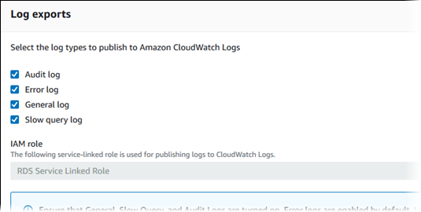
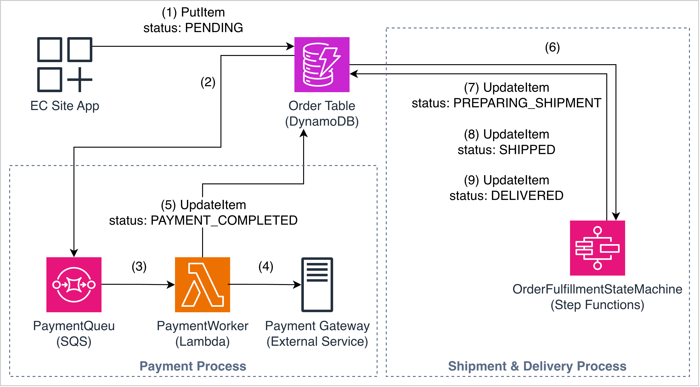

## Cedar policy rules (AWS Amazon Verified Permissions)

Lab section for [Cedar](https://docs.aws.amazon.com/verifiedpermissions/latest/userguide/what-is-avp.html) policy syntax used with AWS Verified Permissions and similar services. Add policy examples from the lab here.

---

## RDS audit logs to CloudWatch

Publish MySQL/MariaDB logs from RDS to CloudWatch Logs.

1. Open the RDS instance in the console.
2. Under **Log exports**, choose which logs to publish (for example audit, error, general, slow query).



Reference: [Publishing MySQL logs to CloudWatch](https://docs.aws.amazon.com/AmazonRDS/latest/UserGuide/USER_LogAccess.Procedural.UploadtoCloudWatch.html)

---

## Export CloudWatch Logs to S3

Create an export task from CloudWatch Logs to S3. The destination bucket needs a policy that allows the CloudWatch Logs service principal.

Reference: [Export log data to S3 (console)](https://docs.aws.amazon.com/AmazonCloudWatch/latest/logs/S3ExportTasksConsole.html)

<details>
<summary>Bucket policy template</summary>

Replace bucket name, account IDs, Region, and log group ARN.

```json
{
  "Version": "2012-10-17",
  "Statement": [
    {
      "Sid": "AllowCloudWatchLogsGetBucketAcl",
      "Action": "s3:GetBucketAcl",
      "Effect": "Allow",
      "Resource": "arn:aws:s3:::amzn-s3-demo-bucket",
      "Principal": { "Service": "logs.us-east-1.amazonaws.com" },
      "Condition": {
        "StringEquals": {
          "aws:SourceAccount": ["123456789012", "111122223333"]
        },
        "ArnLike": {
          "aws:SourceArn": [
            "arn:aws:logs:us-west-2:712746466936:log-group:/aws/rds/instance/jam-db-instance/audit:*"
          ]
        }
      }
    },
    {
      "Sid": "AllowCloudWatchLogsPutObject",
      "Action": "s3:PutObject",
      "Effect": "Allow",
      "Resource": "arn:aws:s3:::amzn-s3-demo-bucket/*",
      "Principal": { "Service": "logs.us-east-1.amazonaws.com" },
      "Condition": {
        "StringEquals": {
          "s3:x-amz-acl": "bucket-owner-full-control",
          "aws:SourceAccount": ["123456789012", "111122223333"]
        },
        "ArnLike": {
          "aws:SourceArn": [
            "arn:aws:logs:us-west-2:712746466936:log-group:/aws/rds/instance/jam-db-instance/audit:*"
          ]
        }
      }
    }
  ]
}
```

</details>

---

## DynamoDB stream to SQS (EventBridge Pipes)

Point-to-point pipe from DynamoDB streams to SQS without a custom poller Lambda.



See also: [EventBridge notes](/aws-event-bridge/) for pipes, filters, and IAM.

---

## Notifications: EventBridge → FIFO SQS → Lambda

**Task checklist**

1. A FIFO queue exists with content-based deduplication enabled.
2. An EventBridge rule targets the FIFO queue with `MessageGroupId` set.
3. Lambda is triggered by the FIFO queue.
4. The old standard queue is not in the active pipeline.

```python
import json
import boto3
import logging

logger = logging.getLogger()
logger.setLevel(logging.INFO)

events_client = boto3.client("events")


def lambda_handler(event, context):
    for record in event.get("Records", []):
        body = json.loads(record["body"])
        detail = body.get("detail", {})
        match_id = detail.get("matchId", "unknown")
        users = detail.get("users", [])

        logger.info(f"MATCH! Processing notification for matchId={match_id}, users={users}")

        # BUG: detail-type is "matchCompleted" but downstream rule
        # rt-log-notification-sent expects "notificationSent"
        events_client.put_events(
            Entries=[{
                "Source": "redthread.notifications",
                "DetailType": "matchCompleted",
                "Detail": json.dumps({
                    "matchId": match_id,
                    "users": users,
                    "status": "sent",
                }),
            }]
        )

    return {"statusCode": 200}
```

**Fix:** align `DetailType` with the downstream rule (`notificationSent` if that is what the rule matches).

---

## EventBridge rules (`put-rule`)

References:

- [Create a rule](https://docs.aws.amazon.com/eventbridge/latest/userguide/eb-create-rule.html)
- [Event pattern operators](https://docs.aws.amazon.com/eventbridge/latest/userguide/eb-create-pattern-operators.html)
- [Pattern best practices](https://docs.aws.amazon.com/eventbridge/latest/userguide/eb-patterns-best-practices.html)

Custom event bus: `register-device-event-bus`

### Single-device registration

**Requirement:**

```json
{
  "registration-type": "single-device",
  "device-count": 1
}
```

- All the requests that are having `registration-type` starting with `single` **AND**
- The requests having `device-count` equals to `1`

**Rule:**

```json
{
  "detail": {
    "registration-type": [{ "prefix": { "equals-ignore-case": "single" } }],
    "device-count": [1]
  }
}
```

```bash
aws events put-rule \
  --name "eb-register-single-device-rule" \
  --event-bus-name "register-device-event-bus" \
  --event-pattern '{"detail":{"registration-type":[{"prefix":{"equals-ignore-case":"single"}}],"device-count":[1]}}'
```

### Bulk device - count 1–99 in any region, or any count in `eu-west-1`

**Requirement:**

```json
{
  "registration-type": "bulk-device",
  "device-count": 99,
  "region": "us-east-1"
}
```

**AND**

```json
{
  "registration-type": "bulk-device",
  "device-count": 100,
  "region": "eu-west-1"
}
```

- All requests that are having `registration-type` value starting with `bulk` **AND**
- The device-count value between `1 and 99` for `any region` **OR** the requests having region value `eu-west-1` (i.e., in case of eu-west-1 the `device-count` value can exceed 100)

**Rule:**

```json
{
  "detail": {
    "registration-type": [{ "prefix": { "equals-ignore-case": "bulk" } }],
    "$or": [
      { "device-count": [{ "numeric": [">=", 1, "<=", 99] }] },
      { "region": ["eu-west-1"] }
    ]
  }
}
```

```bash
aws events put-rule \
  --name "eb-register-bulk-device-rule" \
  --event-bus-name "register-device-event-bus" \
  --event-pattern '{"detail":{"registration-type":[{"prefix":{"equals-ignore-case":"bulk"}}],"$or":[{"device-count":[{"numeric":[">=",1,"<=",99]}]},{"region":["eu-west-1"]}]}}'
```

### Bulk device - count greater than 100 outside `eu-west-1`

**Requirement:**

```json
{
  "registration-type": "bulk-device",
  "device-count": 100,
  "region": "us-east-1"
}
```

**AND**

```json
{
  "registration-type": "bulk-device",
  "device-count": 100,
  "region": "ap-southeast-1"
}
```

- The requests having registration-type value starting with bulk
- The requests having device-count greater than 100 **AND** requests having region value other than eu-west-1

**Rule:**

```json
{
  "detail": {
    "registration-type": [{ "prefix": { "equals-ignore-case": "bulk" } }],
    "device-count": [{ "numeric": [">=", 100] }],
    "region": [{ "anything-but": "eu-west-1" }]
  }
}
```

```bash
aws events put-rule \
  --name "eb-register-bulk-device-with-priority-rule" \
  --event-bus-name "register-device-event-bus" \
  --event-pattern '{"detail":{"registration-type":[{"prefix":{"equals-ignore-case":"bulk"}}],"device-count":[{"numeric":[">=",100]}],"region":[{"anything-but":"eu-west-1"}]}}'
```

### Privileged customers → Lambda

**Requirement:**

```json
{
  "privileged": "true"
}
```

- Route the requests containing the `privileged` property to lambda function mentioned above

**Rule:**

```json
{
  "detail": {
    "privileged": ["true"]
  }
}
```

```bash
aws events put-rule \
  --name "eb-reward-privileged-customer-rule" \
  --event-bus-name "register-device-event-bus" \
  --event-pattern '{"detail":{"privileged":["true"]}}'
```

### Image URL validation

**Requirement:**

```json
{
  "image-url": "https://sampleurl.com/sample.png"
}
```

- The value for image-url should have a value **AND**
- The value for image-url property should end with `.png` / `.jpeg` / `.jpg` / `.gif`

**Rule:**

```json
{
  "detail": {
    "image-url": [
      { "suffix": ".png" },
      { "suffix": ".jpeg" },
      { "suffix": ".jpg" },
      { "suffix": ".gif" }
    ]
  }
}
```

```bash
aws events put-rule \
  --name "eb-save-image-rule" \
  --event-bus-name "register-device-event-bus" \
  --event-pattern '{"detail":{"image-url":[{"suffix":".png"},{"suffix":".jpeg"},{"suffix":".jpg"},{"suffix":".gif"}]}}'
```

---

## Backup and restore

### AWS Backup IAM policies

| Action | AWS managed policy |
| --- | --- |
| Backup | `AWSBackupServiceRolePolicyForBackup` |
| Restore | `AWSBackupServiceRolePolicyForRestores` |

### EventBridge target (auto-recover)

```bash
aws events put-targets \
  --rule "xyz-auto-recover-rule" \
  --targets "Id"="1","Arn"="arn:aws:lambda:ap-northeast-1:300457517613:function:xyz-auto-recover"
```

### Flows (lab step numbers)

**Backup:** EC2 enters `running` → EventBridge Rule 1 → Backup Lambda → backup in vault  
`1 → 4 → 2 → 6`

**Restore:** EC2 terminated → EventBridge Rule 2 → Recover Lambda → retrieve from vault → new EC2  
`1 → 5 → 3 → 6 → 1`


---

## Windows / RDP and IMDS

Symptom: Windows instance cannot reach IMDS at `169.254.169.254`.

Gateway IP is the subnet default route for `0.0.0.0` in `route print`. Prefer [IMDSv2](https://docs.aws.amazon.com/AWSEC2/latest/UserGuide/configuring-instance-metadata-service.html).

```powershell
route print
route DELETE 169.254.169.254
route -p ADD 169.254.169.254 MASK 255.255.255.255 <SUBNET_GATEWAY_IP>

iwr -Uri 'http://169.254.169.254/latest/meta-data/'

netsh winhttp reset proxy
W32tm /resync /force
Restart-Service AmazonSSMAgent
```

Always restart the SSM agent after network/proxy changes: `Restart-Service AmazonSSMAgent`.

---

## Systems Manager (SSM)

RDP down, SSM up (or SSM instead of RDP): agent on the AMI, instance role `AmazonSSMManagedInstanceCore`, outbound **TCP 443** via NAT or Interface endpoints.

SSM agent **offline**: missing role, no path to SSM APIs, no VPC endpoints on a private subnet, SG/NACL blocking 443.

| Need | What |
| --- | --- |
| Role | `AmazonSSMManagedInstanceCore` on the instance |
| Endpoints | `ssm`, `ec2messages`, `ssmmessages` in `com.amazonaws.<region>.*` |
| Endpoint SG | Inbound **443** from instance SG / VPC CIDR |
| Placement | Endpoints in the instance’s subnets (or routed to them) |

Template: [`dir/ssm-vpc-endpoint.yaml`](./dir/ssm-vpc-endpoint.yaml)

---

## CloudWatch Agent

Instance role: `CloudWatchAgentServerPolicy`. [IAM](https://docs.aws.amazon.com/AmazonCloudWatch/latest/monitoring/create-iam-roles-for-cloudwatch-agent.html) · [Install](https://docs.aws.amazon.com/AmazonCloudWatch/latest/monitoring/install-CloudWatch-Agent-on-EC2-Instance.html)

Linux (AL2 / yum):

```bash
sudo yum install amazon-cloudwatch-agent
cd /opt/aws/amazon-cloudwatch-agent/bin
sudo ./amazon-cloudwatch-agent-ctl -a start -m ec2 -c default -s
```

Windows: install from the same install doc; start the **Amazon CloudWatch Agent** service.

---

## ACM Private CA

CA chain (trust store):

```bash
aws acm-pca get-certificate-authority-certificate \
  --certificate-authority-arn arn:aws:acm-pca:<region>:<account-id>:certificate-authority/<ca-id> \
  --output text > ca_certificate.pem
```

Issued cert:

```bash
aws acm-pca get-certificate \
  --certificate-authority-arn "<CA_ARN>" \
  --certificate-arn "<CERT_ARN>" \
  --query 'Certificate' --output text > cert.pem
```

Chain for that cert: `--query 'CertificateChain'` → `cert_chain.pem`.

[get-certificate-authority-certificate](https://docs.aws.amazon.com/cli/latest/reference/acm-pca/get-certificate-authority-certificate.html) · [get-certificate](https://docs.aws.amazon.com/cli/latest/reference/acm-pca/get-certificate.html)

---

## AWS Config (Guard)

SG open to the world (`0.0.0.0/0` / `::/0`). Managed check for CodeBuild plaintext AWS creds in env: [`codebuild-project-envvar-awscred-check`](https://docs.aws.amazon.com/config/latest/developerguide/codebuild-project-envvar-awscred-check.html).

<details>
<summary>Guard rules (lab)</summary>

```guard
rule check_ip_protocol_and_port_range_validity
{
    let any_ip_permissions = this.configuration.ipPermissions[
        some ipv4Ranges[*].cidrIp == "0.0.0.0/0" or
        some ipv6Ranges[*].cidrIpv6 == "::/0"
        ipProtocol != "udp"
    ]

    when %any_ip_permissions !empty
    {
        %any_ip_permissions {
            this.ipProtocol != "-1"
            this.InputParameters.TcpBlockedPorts[*] {
                this.fromPort > this or
                this.toPort < this
                <<
                    result: NON_COMPLIANT
                    message: Blocked TCP port was allowed in range
                >>
            }
        }
    }
}

rule ipv4_unrestricted_inbound when this.configuration.ipPermissions[*].ipv4Ranges !empty {
    this.configuration.ipPermissions[*].ipv4Ranges[*].cidrIp != "0.0.0.0/0"
    <<
        result: NON_COMPLIANT
        message: IPv4 Source address cannot be 0.0.0.0/0
    >>
}

rule ipv6_unrestricted_inbound when this.configuration.ipPermissions[*].ipv6Ranges !empty {
    this.configuration.ipPermissions[*].ipv6Ranges[*].cidrIpv6 != "::/0"
    <<
        result: NON_COMPLIANT
        message: IPv6 Source address cannot be ::/0
    >>
}
```

</details>

---

## Traffic mirroring

VXLAN to the target: target SG inbound **UDP 4789**. Session Manager → monitor host:

```bash
sudo tcpdump -lnvX icmp
```

---

## KMS grant (CodeBuild)

```bash
aws kms create-grant \
  --key-id KEY_ARN \
  --grantee-principal arn:aws:iam::ACCOUNT_ID:role/locksmith-codebuild-role \
  --operations Decrypt GenerateDataKey \
  --name locksmith-codebuild-s3-access \
  --region us-east-1
```

---

## DynamoDB (boto3)

```python
from boto3.dynamodb.conditions import Key
from boto3.dynamodb.types import TypeDeserializer

d = TypeDeserializer()
item = {k: d.deserialize(value=v) for k, v in raw.items()}

results = dynamo_table.query(KeyConditionExpression=Key("CustID").eq(cust_id))
row = results["Items"][0] if results["Items"] else None

dynamo_table.put_item(Item=cust_profile)
```

---

## FSx ONTAP and EBS

FSx SG: inbound **NFS 2049** from the EC2 SG.

```bash
sudo mkdir -p /mnt/fsx
sudo mount -t nfs -o nfsvers=4.1 <fsx-dns-name>:/vol1 /mnt/fsx
```

EBS: attach volume, `lsblk` for the device (often `/dev/nvme1n1`, not `/dev/sdf`). `mkfs` **wipes** the volume.

```bash
lsblk
sudo mkfs.ext4 /dev/nvme1n1
sudo mkdir -p /mnt/ebs
sudo mount /dev/nvme1n1 /mnt/ebs
```

Copy FSx → EBS: `sudo rsync -av /mnt/fsx/ /mnt/ebs/`

---

## Redshift COPY (JSON)

[COPY JSON examples (`auto ignorecase`)](https://docs.aws.amazon.com/redshift/latest/dg/r_COPY_command_examples.html#copy-from-json-examples-using-auto-ignorecase)