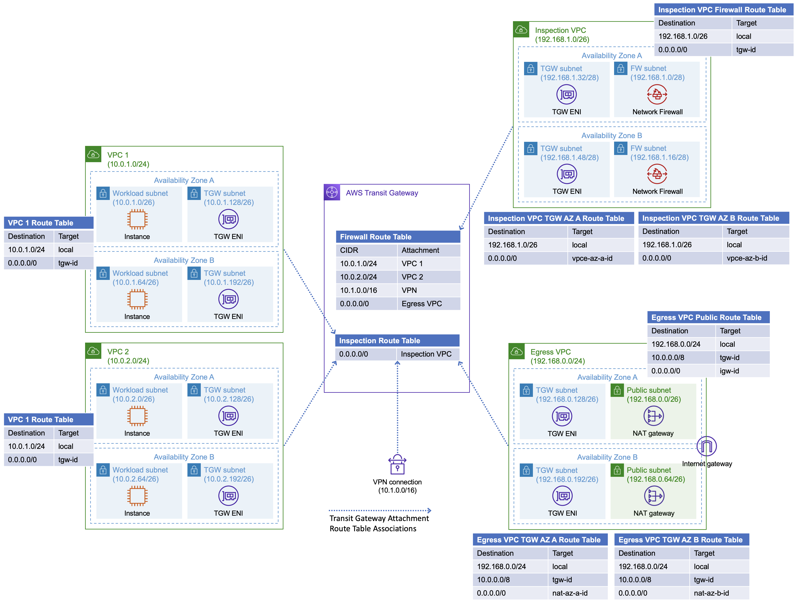
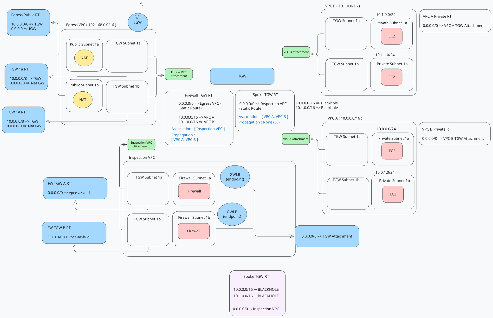
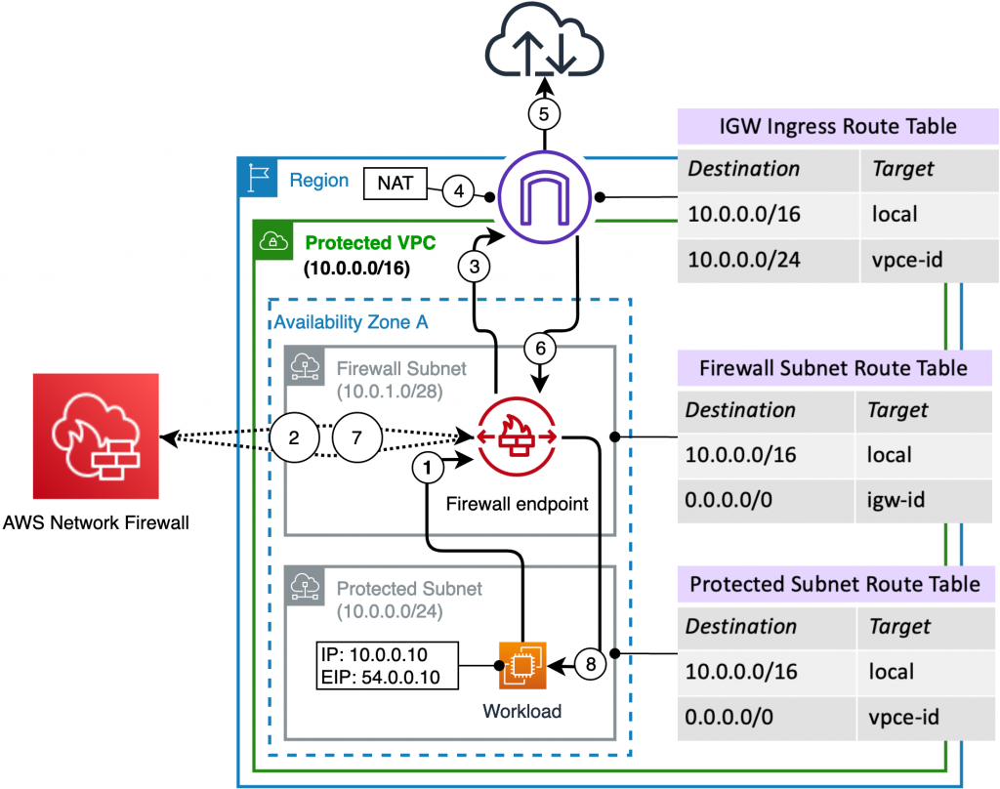

## Pattern

Spokes have no IGW and no NAT. Internet-bound packets go **Transit Gateway → inspection VPC (Network Firewall) → egress VPC (NAT + IGW)**.





Templates: [`dir/vpc/egress-firewall/`](./dir/vpc/egress-firewall/tgw.yaml)

| VPC | CIDR (defaults) | Role |
| --- | --- | --- |
| spoke-a | `10.0.0.0/16` | Workloads. Private `0.0.0.0/0` → TGW |
| spoke-b | `10.1.0.0/16` | Same, different CIDRs |
| inspection | `10.3.0.0/16` | TGW subnets + firewall subnets (two AZs) |
| egress | `192.168.0.0/16` | TGW subnets + public NAT/IGW |

Network Firewall is created in the **firewall subnets**. AWS places a **Gateway Load Balancer endpoint** (`vpce-…`) in each of those subnets. TGW subnet route tables send `0.0.0.0/0` to the endpoint **in the same AZ**.

---

## Traffic

```text
Spoke private subnet
        │  0.0.0.0/0 → TGW
        ▼
 TGW spoke route table
        │  0.0.0.0/0 → inspection attachment
        ▼
 Inspection TGW subnet
        │  0.0.0.0/0 → firewall vpce (same AZ)
        ▼
 Network Firewall
        │  0.0.0.0/0 → TGW
        ▼
 TGW inspection route table
        │  0.0.0.0/0 → egress attachment
        ▼
 Egress TGW subnet → NAT → IGW → internet
```

Return: NAT public RT `10.0.0.0/8` → TGW; **egress** TGW table uses **spoke propagations** (spoke CIDRs → spoke attachments). This stack does not hairpin return through inspection.

Spoke CIDRs are **blackholed** on the spoke TGW table, so spoke-a cannot reach spoke-b via TGW.

---

## TGW tables

Default association and propagation are **off** ([`tgw.yaml`](./dir/vpc/egress-firewall/tgw.yaml)). Every attachment is associated to one table; extra CIDRs appear only from **routes** or **propagations** ([`routing.yaml`](./dir/vpc/egress-firewall/routing.yaml)).

| Term | Meaning |
| --- | --- |
| Association | Which table this attachment **looks up** |
| Propagation | Copy that attachment’s CIDR **into** a table |
| Static route | Explicit next hop (or blackhole) |

| Table | Associated attachments | How packets leave |
| --- | --- | --- |
| Spoke | spoke-a, spoke-b | `0.0.0.0/0` → inspection. Blackhole each spoke CIDR |
| Inspection | inspection VPC | `0.0.0.0/0` → egress. Spokes **propagated** (return to workloads) |
| Egress | egress VPC | Spokes **propagated** (return from NAT) |

---

## Appliance mode



Firewall state is per endpoint. If TGW sends the forward flow to AZ-a and the return to AZ-b, the session breaks. **Appliance mode** on the **inspection** VPC attachment pins both directions of a flow to one AZ.

Already set in [`inspection.yaml`](./dir/vpc/egress-firewall/inspection.yaml) (`ApplianceModeSupport: enable`). Spoke and egress attachments leave it **disabled**. Equivalent after the fact:

```bash
aws ec2 modify-transit-gateway-vpc-attachment \
  --transit-gateway-attachment-id tgw-attach-INSPECTION \
  --options ApplianceModeSupport=enable
```

---

## Firewall policy

[`inspection.yaml`](./dir/vpc/egress-firewall/inspection.yaml): stateless default **forward to stateful**. Stateful group: **ALLOWLIST** `TLS_SNI` `.amazonaws.com`. Anything else that hits the stateful engine is not on that allowlist.

---

## Deploy

Run from `dir/vpc/egress-firewall/`. TGW first. Inspection, egress, and spokes in parallel. **Routing last** (needs all attachment exports).

```bash
aws cloudformation deploy --stack-name egress-fw-tgw \
  --template-file tgw.yaml

aws cloudformation deploy --stack-name egress-fw-inspection \
  --template-file inspection.yaml --parameter-overrides TgwStackName=egress-fw-tgw

aws cloudformation deploy --stack-name egress-fw-egress \
  --template-file egress.yaml --parameter-overrides TgwStackName=egress-fw-tgw

aws cloudformation deploy --stack-name egress-fw-spoke-a \
  --template-file spoke.yaml \
  --parameter-overrides TgwStackName=egress-fw-tgw VpcName=spoke-a-vpc VpcCidr=10.0.0.0/16

aws cloudformation deploy --stack-name egress-fw-spoke-b \
  --template-file spoke.yaml \
  --parameter-overrides TgwStackName=egress-fw-tgw VpcName=spoke-b-vpc VpcCidr=10.1.0.0/16 \
    PrivateSubnetACidr=10.1.11.0/24 PrivateSubnetBCidr=10.1.12.0/24 \
    TgwSubnetACidr=10.1.21.0/28 TgwSubnetBCidr=10.1.22.0/28

aws cloudformation deploy --stack-name egress-fw-routing \
  --template-file routing.yaml
```

[`egress.yaml`](./dir/vpc/egress-firewall/egress.yaml) uses **one NAT** in AZ-a for both TGW subnets. [`spoke.yaml`](./dir/vpc/egress-firewall/spoke.yaml) is reused per spoke.

---

## Check

- Spoke private RT: `0.0.0.0/0` → TGW  
- Inspection TGW RT (per AZ): `0.0.0.0/0` → firewall `vpce` in that AZ  
- Inspection firewall RT: `0.0.0.0/0` → TGW  
- Egress TGW RT: `0.0.0.0/0` → NAT; public RT: `0.0.0.0/0` → IGW and `10.0.0.0/8` → TGW  
- Inspection attachment: appliance mode **enable**  
- From a spoke instance: TLS to a `*.amazonaws.com` name should pass; other destinations should fail the allowlist  

---

## References

- [Deploy centralized traffic filtering using AWS Network Firewall](https://aws.amazon.com/blogs/networking-and-content-delivery/deploy-centralized-traffic-filtering-using-aws-network-firewall/)
- [Deployment models for AWS Network Firewall](https://aws.amazon.com/blogs/networking-and-content-delivery/deployment-models-for-aws-network-firewall/)
- [Appliance mode](https://docs.aws.amazon.com/vpc/latest/tgw/transit-gateway-appliance-scenario.html)
- [TGW route tables](https://docs.aws.amazon.com/vpc/latest/tgw/tgw-route-tables.html)
- [Networking on AWS](./networking-on-aws.md)
