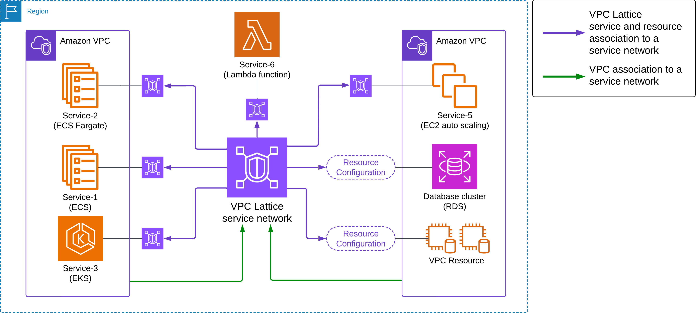

## Lattice objects


| Object | Role |
| --- | --- |
| Service network | Boundary for associated services and resource configurations |
| Service | Listeners → rules → target groups |
| Listener | HTTP, HTTPS, or TLS on a port |
| Rule / default rule | Forward to a target group |
| Target group | Instance, IP, Lambda, ALB, Kubernetes |

---

## What this lab deploys



| Diagram | Lab | Lattice object | Source |
| --- | --- | --- | --- |
| Left VPC / Service-1 ECS | Order service, VPC-A | Service | [`ecs-order-service/`](./dir/vpc/vpc-lattice-networking/ecs-order-service/app.py) |
| Left VPC / Service-2 ECS Fargate | Same app, Fargate launch type | Service | same |
| Left VPC / Service-3 EKS | Inventory, VPC-A | Service | [`eks-inventory-service/`](./dir/vpc/vpc-lattice-networking/eks-inventory-service/app.py) |
| Service-6 Lambda | Notifications | Service (Lambda TG) | [`lambda-notification-service/`](./dir/vpc/vpc-lattice-networking/lambda-notification-service/lambda_function.py) |
| Right VPC / Service-5 EC2 ASG | Customers, VPC-B | Service | [`ec2-customer-service/`](./dir/vpc/vpc-lattice-networking/ec2-customer-service/app.py) |
| RDS | PostgreSQL, VPC-B | Resource configuration | [`rds/init.sql`](./dir/vpc/vpc-lattice-networking/rds/init.sql) |
| VPC Resource | Private config API, VPC-B | Resource configuration | [`private-config-resource/`](./dir/vpc/vpc-lattice-networking/private-config-resource/app.py) |

Green arrows: VPC → service network. Purple arrows: service or resource-configuration → service network.

Apps listen on **8080**. Local compose ports: [`docker-compose.yml`](./dir/vpc/vpc-lattice-networking/docker-compose.yml). Lattice HTTP listeners use **:80** → target **8080**.

---

## 1. ECS Order Service (VPC-A)

1. Build/push [`ecs-order-service/Dockerfile`](./dir/vpc/vpc-lattice-networking/ecs-order-service/Dockerfile) to ECR.
2. Task definition: container port **8080**, named `portMappings` entry (needed for Lattice `portName`).
3. ECS cluster + service in VPC-A private subnets (Fargate or EC2). Do not attach an ALB.
4. Task security group: allow **8080** from the Lattice prefix list after step 4 (create the SG now; add the prefix-list rule then).

Health: `GET /health`. Routes: `GET /orders`, `GET /orders/{id}`, `POST /orders`.

---

## 2. Service network

VPC → **PrivateLink and Lattice** → **Service networks** → **Create**.

| Field | Value |
| --- | --- |
| Name | `lattice-sn` |
| Auth type | None |

CLI:

```bash
aws vpc-lattice create-service-network --name lattice-sn
```

VPC association (clients in that VPC can call associated services/resources). Attach a security group on the association (inbound HTTP **80** from the VPC CIDR). Associate **VPC-A** now; associate **VPC-B** when that VPC exists.

```bash
aws vpc-lattice create-service-network-vpc-association \
  --service-network-identifier lattice-sn \
  --vpc-identifier vpc-VPC-A \
  --security-group-ids sg-ASSOCIATION-A
```

---

## 3. Lattice service for orders

1. Target group: type **IP**, protocol **HTTP**, port **8080**, VPC-A.
2. ECS service: enable VPC Lattice (`vpcLatticeConfigurations`: target group ARN, `portName` from the task definition, role with `AmazonECSInfrastructureRolePolicyForVpcLattice`). ECS registers task IPs. Rolling deployments only.
3. Lattice service (e.g. `order-service`) + listener **HTTP :80** → that target group.
4. Service association:

```bash
aws vpc-lattice create-service-network-service-association \
  --service-network-identifier lattice-sn \
  --service-identifier svc-ORDER
```

Copy the service domain (`svc-….vpc-lattice-svcs.<region>.on.aws`).

---

## 4. Security groups

| Attachment | Inbound / outbound |
| --- | --- |
| Service-network VPC association | Inbound TCP **80** from that VPC’s client CIDR |
| ECS task SG | Inbound TCP **8080** from `com.amazonaws.<region>.vpc-lattice` |
| Client (if outbound is restricted) | Outbound TCP **80** to the same prefix list |

Do not use the client SG as the source on targets. Packets to targets come from Lattice.

---

## 5. EKS Inventory Service (VPC-A)

Same service network. Cluster subnets in VPC-A.

1. Build/push [`eks-inventory-service/Dockerfile`](./dir/vpc/vpc-lattice-networking/eks-inventory-service/Dockerfile).
2. Apply [`eks-inventory-service/k8s/deployment.yaml`](./dir/vpc/vpc-lattice-networking/eks-inventory-service/k8s/deployment.yaml) (replace `REPLACE_WITH_ECR_IMAGE`). ClusterIP **80** → pod **8080**. `GET /health`, `GET /inventory/{sku}`.
3. Install the [AWS Gateway API Controller](https://www.gateway-api-controller.eks.aws.dev/) in the cluster.
4. `GatewayClass` `amazon-vpc-lattice`. `Gateway` whose spec points at service network `lattice-sn` (controller creates the Lattice service and associates it by default).
5. `HTTPRoute` `parentRefs` → that Gateway; `backendRefs` → Kubernetes Service `inventory-service` port **80**.
6. Pod / node security group: inbound TCP **8080** from `com.amazonaws.<region>.vpc-lattice`.

If you skip the controller: IP target group HTTP **8080** in VPC-A, Lattice service HTTP **80**, `create-service-network-service-association` to `lattice-sn`, and register pod IPs yourself (they change on reschedule).

---

## 6. EC2 Customer Service (VPC-B)

1. Associate VPC-B with `lattice-sn` (association SG: inbound **80** from VPC-B CIDR).
2. Instance in a private subnet. [`user-data.sh`](./dir/vpc/vpc-lattice-networking/ec2-customer-service/user-data.sh) runs uvicorn **8080**. App: [`ec2-customer-service/app.py`](./dir/vpc/vpc-lattice-networking/ec2-customer-service/app.py) — `GET /customers/{id}`.
3. Instance target group HTTP **8080**. Lattice service `customer-service`, listener HTTP **80**. Associate with `lattice-sn`.
4. Instance SG: inbound **8080** from the Lattice prefix list.

```text
ECS order-service (VPC-A)
        │ HTTP :80
        ▼
   lattice-sn
        │
        ▼
 customer-service → instance TG → EC2 :8080
```

---

## 7. Lambda notification service

Create the function from [`lambda_function.py`](./dir/vpc/vpc-lattice-networking/lambda-notification-service/lambda_function.py). Target group type **Lambda**. Lattice service, HTTP listener, associate with `lattice-sn`. No VPC, no prefix-list SG.

---

## 8. RDS and private config (resource configurations, VPC-B)

Not Lattice services. Path: associated VPC → `lattice-sn` → resource configuration → **resource gateway** in VPC-B → target. Source IP on the target is the gateway ENI.

**RDS**

1. Load [`rds/init.sql`](./dir/vpc/vpc-lattice-networking/rds/init.sql).
2. Resource gateway `rds-resource` in VPC-B. SG `rds-resource-sg`: outbound TCP **5432** to RDS.
3. RDS SG `rds-pgql`: inbound **5432** from `rds-resource-sg`.
4. Resource configuration `orders-db` (RDS ARN or IP:5432) on that gateway. Associate `orders-db` with `lattice-sn`.
5. Client DNS: service-network resource association (ARN configs can keep the RDS hostname if private DNS is on).

**VPC Resource** ([`private-config-resource/app.py`](./dir/vpc/vpc-lattice-networking/private-config-resource/app.py) on **8080**, `GET /config`)

Same gateway or a second one. Resource configuration type IP, port **8080**. Target SG: inbound **8080** from the resource-gateway SG (not the Lattice service prefix list).

---

## 9. Call through Lattice

Replace hosts in [`requests/sample-requests.sh`](./dir/vpc/vpc-lattice-networking/requests/sample-requests.sh) with Lattice service domains (and the resource-association DNS for RDS / config). Run from an instance in VPC-A or VPC-B (both associated).

---

## References

- [Create a service network](https://docs.aws.amazon.com/vpc-lattice/latest/ug/service-networks.html)
- [Security groups / prefix lists](https://docs.aws.amazon.com/vpc-lattice/latest/ug/security-groups.html)
- [ECS and VPC Lattice](https://docs.aws.amazon.com/AmazonECS/latest/developerguide/ecs-vpc-lattice.html)
- [AWS Gateway API Controller (EKS)](https://www.gateway-api-controller.eks.aws.dev/)
- [Resource gateways](https://docs.aws.amazon.com/vpc-lattice/latest/ug/resource-gateway.html)
- [Path-based HTTP lab](./vpc-lattice.md)
