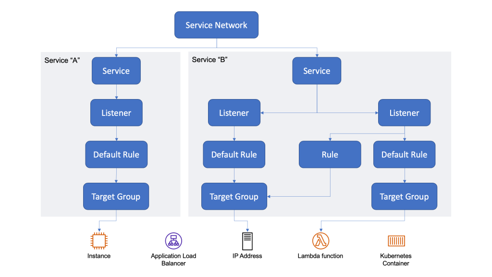

## Overview

Amazon **VPC Lattice** provides application-layer connectivity between services across VPCs and accounts. This lab exposes one Lattice service with two backends — an EC2 Flask app and a Lambda function — then routes by path prefix and weighted default action.



| Component | Role |
| --- | --- |
| EC2 instance | HTTP backend on port `8080` |
| Lambda function | Serverless backend |
| Target groups | Register EC2 and Lambda targets |
| Lattice service | Listener, routing rules, auth policy |
| Service network | VPC association and client access |

**Traffic flow**

```text
Client (EC2 in associated VPC)
        │
        ▼
Service network association
        │
        ▼
VPC Lattice service (listener :80 / :443)
        │
        ├─ /to-instance ──► instance target group ──► EC2 :8080
        ├─ /to-lambda   ──► lambda target group   ──► Lambda
        └─ default      ──► 90% instance / 10% lambda
```

---

## Backends

### Backend A: EC2 instance (Flask)

Run a simple Flask app on an EC2 instance in the **same VPC** you will associate with the service network.

**Reference app:** [`dir/lambda/flask/simple/simple.py`](./dir/lambda/flask/simple/simple.py)

```python
from flask import Flask

app = Flask(__name__)

@app.route('/')
def index():
    return 'Hello from the EC2 instance'

@app.route('/<path:path>')
def some_path(path):
    return f'Hello from the EC2 instance at path "{path}"'

if __name__ == '__main__':
    app.run(host='0.0.0.0', port=8080)
```

**`requirements.txt`**

```text
flask
```

**Deploy on the instance**

```bash
# 1. Install dependencies
pip3 install -r requirements.txt

# 2. Run the application in the background
nohup python3 app.py > app.log 2>&1 &

# 3. Verify locally
curl http://localhost:8080/test
```

> **Security group:** Allow inbound TCP **8080** from the VPC CIDR (or the AWS managed prefix list for VPC Lattice).

### Backend B: Lambda function

Create a standard Python 3.x Lambda that returns a simple HTTP response (for example via Lambda Function URLs or a minimal handler compatible with Lattice Lambda targets).

---

## Target groups

Create two target groups in VPC Lattice:

| Target group | Type | Protocol / port | Target |
| --- | --- | --- | --- |
| `instance-lattice-tg` | Instance | HTTP / `8080` | EC2 instance running Flask |
| `lambda-lattice-tg` | Lambda function | — | Configured Lambda function |

---

## Lattice service

### Auth policy (IAM)

Attach an auth policy that allows clients to invoke the service. For a lab, start permissive and tighten later.

```json
{
  "Version": "2012-10-17",
  "Statement": [
    {
      "Effect": "Allow",
      "Principal": "*",
      "Action": "vpc-lattice-svcs:Invoke",
      "Resource": "*"
    }
  ]
}
```

### Access logs

Enable access logs on the service (CloudWatch Logs or S3) before testing routing rules.

### Listeners and routing rules

Create an **HTTP** listener on port **80** (or **HTTPS** on **443**) with:

| Priority | Condition | Action |
| --- | --- | --- |
| Rule 1 | Path prefix `/to-instance` | Forward 100% → `instance-lattice-tg` |
| Rule 2 | Path prefix `/to-lambda` | Forward 100% → `lambda-lattice-tg` |
| Default | (no match) | Forward 90% → `instance-lattice-tg`, 10% → `lambda-lattice-tg` |

> **Weighted default:** Target weights must sum to exactly **100%**.

---

## Service network

1. Create or select a **service network**.
2. Associate the Lattice **service** created above.
3. **Associate a VPC** — choose the VPC where your client EC2 instance lives.
4. Attach a **security group** to the service network VPC association:
   - Inbound: allow HTTP **80** / HTTPS **443** from the VPC CIDR.
5. Copy the **service domain name** from the service association details, for example:

   ```text
   svc-0abc123def456789a.abc123.vpc-lattice-svcs.us-east-1.on.aws
   ```

   See [AWS: finding the service domain name](https://d2908q01vomqb2.cloudfront.net/da4b9237bacccdf19c0760cab7aec4a8359010b0/2022/11/20/vpc-lattice-service-domain-name.png).

---

## Test from a client EC2 instance

Run `curl` from an instance in the associated VPC:

```bash
# Path-based rules
curl "http://${LATTICE_SERVICE_DOMAIN}/to-instance/hello"
curl "http://${LATTICE_SERVICE_DOMAIN}/to-lambda/hello"

# Default weighted routing (repeat to observe distribution)
curl "http://${LATTICE_SERVICE_DOMAIN}/"
```

Replace `${LATTICE_SERVICE_DOMAIN}` with the domain name from the service network association.

---

## References

- [VPC Lattice service networks](https://docs.aws.amazon.com/vpc-lattice/latest/ug/service-networks.html)
- [VPC Lattice use cases (PDF)](https://docs.aws.amazon.com/pdfs/architecture-diagrams/latest/amazon-vpc-lattice-use-cases/amazon-vpc-lattice-use-cases.pdf)
- [Networking on AWS — VPC Lattice](./networking-on-aws.md#vpc-lattice)
